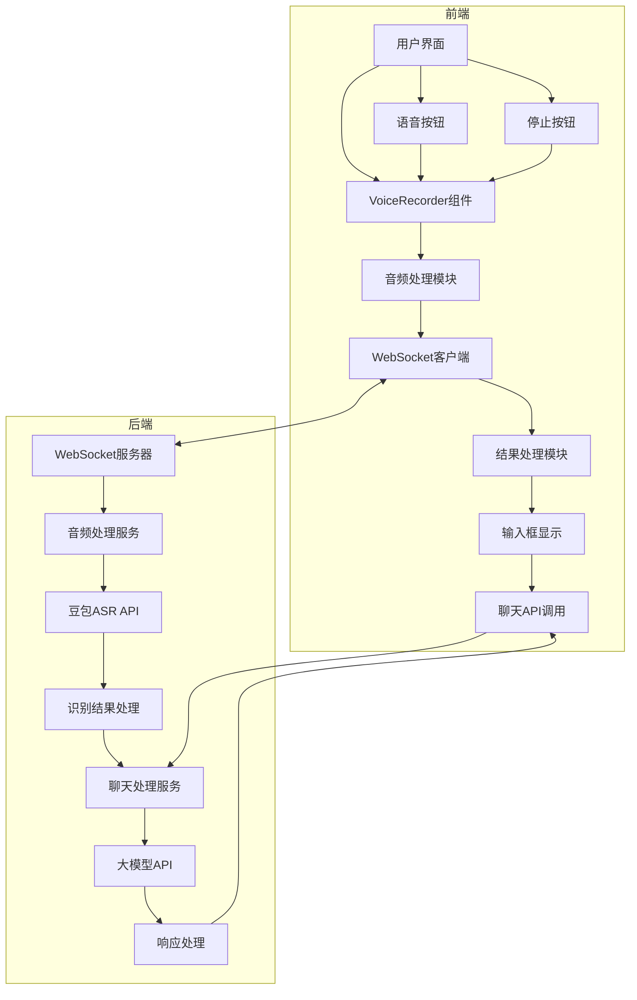
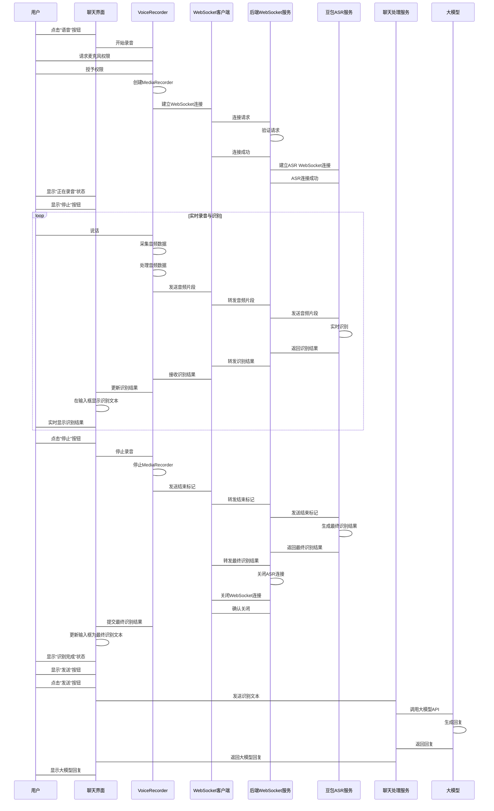
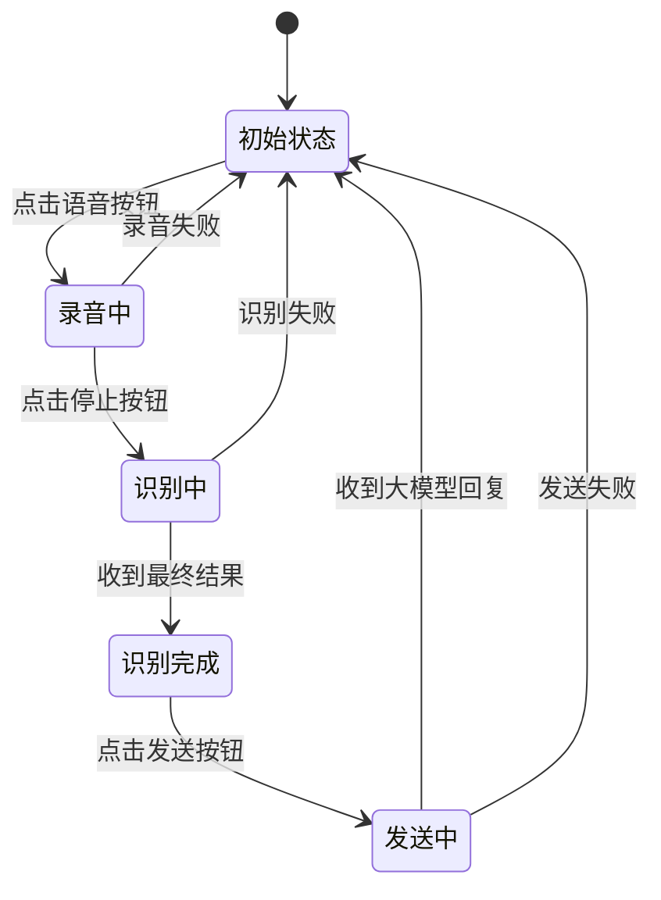

# 语音与大模型交互完整流程设计（手动控制版）

## 1. 系统架构



## 2. 详细交互流程

### 2.1 语音录制与识别完整流程



## 3. 前端界面设计

### 3.1 界面元素

| 元素 | 状态 | 功能 |
|------|------|------|
| 语音按钮 | 初始状态 | 开始录音 |
| 停止按钮 | 录音中显示 | 停止录音 |
| 发送按钮 | 识别完成显示 | 发送识别结果 |
| 输入框 | 始终显示 | 显示识别结果 |
| 状态提示 | 动态显示 | 显示当前状态 |

### 3.2 状态转换



## 4. 技术实现

### 4.1 前端实现

#### VoiceRecorder.tsx 核心代码：

```typescript
import React, { useState, useRef } from 'react';

export const VoiceRecorder: React.FC = () => {
  const [isRecording, setIsRecording] = useState(false);
  const [recognizedText, setRecognizedText] = useState('');
  const [status, setStatus] = useState('初始状态');
  const [showStopButton, setShowStopButton] = useState(false);
  const [showSendButton, setShowSendButton] = useState(false);
  
  const mediaRecorderRef = useRef<MediaRecorder | null>(null);
  const streamRef = useRef<MediaStream | null>(null);
  const websocketRef = useRef<WebSocket | null>(null);
  
  // 开始录音
  const startRecording = async () => {
    try {
      setStatus('请求麦克风权限...');
      
      // 请求麦克风权限
      const stream = await navigator.mediaDevices.getUserMedia({ audio: true });
      streamRef.current = stream;
      
      // 创建MediaRecorder
      const mediaRecorder = new MediaRecorder(stream, { mimeType: 'audio/webm' });
      mediaRecorderRef.current = mediaRecorder;
      
      // 建立WebSocket连接
      setStatus('连接语音识别服务...');
      const ws = new WebSocket('wss://your-backend.com/api/v1/voice/stream');
      websocketRef.current = ws;
      
      // WebSocket事件处理
      ws.onopen = () => {
        setStatus('正在录音...');
        setIsRecording(true);
        setShowStopButton(true);
        setShowSendButton(false);
      };
      
      ws.onmessage = (event) => {
        const data = JSON.parse(event.data);
        if (data.type === 'partial') {
          setRecognizedText(data.text);
        } else if (data.type === 'final') {
          setRecognizedText(data.text);
          setStatus('识别完成');
          setShowStopButton(false);
          setShowSendButton(true);
        } else if (data.type === 'error') {
          setStatus(`错误: ${data.message}`);
          stopRecording();
        }
      };
      
      ws.onerror = () => {
        setStatus('连接失败');
        stopRecording();
      };
      
      ws.onclose = () => {
        if (isRecording) {
          setStatus('连接已关闭');
          stopRecording();
        }
      };
      
      // 处理音频数据
      mediaRecorder.ondataavailable = (event) => {
        if (event.data.size > 0 && websocketRef.current?.readyState === WebSocket.OPEN) {
          // 转换音频数据并发送
          event.data.arrayBuffer().then((buffer) => {
            const audioData = new Uint8Array(buffer);
            const base64Data = btoa(String.fromCharCode(...audioData));
            
            websocketRef.current?.send(JSON.stringify({
              type: 'audio',
              data: base64Data
            }));
          });
        }
      };
      
      // 开始录音
      mediaRecorder.start(200); // 每200ms发送一次数据
      
    } catch (error) {
      console.error('开始录音失败:', error);
      setStatus('无法访问麦克风');
    }
  };
  
  // 停止录音
  const stopRecording = () => {
    if (mediaRecorderRef.current) {
      mediaRecorderRef.current.stop();
    }
    
    if (streamRef.current) {
      streamRef.current.getTracks().forEach(track => track.stop());
    }
    
    if (websocketRef.current?.readyState === WebSocket.OPEN) {
      websocketRef.current.send(JSON.stringify({ type: 'end' }));
      websocketRef.current.close();
    }
    
    setIsRecording(false);
    setShowStopButton(false);
  };
  
  // 发送识别结果
  const sendResult = () => {
    if (recognizedText.trim()) {
      setStatus('发送中...');
      setShowSendButton(false);
      
      // 调用聊天API发送消息
      fetch('/api/v1/chat/messages', {
        method: 'POST',
        headers: { 'Content-Type': 'application/json' },
        body: JSON.stringify({ message: recognizedText })
      })
      .then(response => response.json())
      .then(data => {
        if (data.code === 200) {
          setStatus('发送成功');
          setRecognizedText('');
          // 刷新聊天界面
        } else {
          setStatus('发送失败');
          setShowSendButton(true);
        }
      })
      .catch(error => {
        console.error('发送失败:', error);
        setStatus('发送失败');
        setShowSendButton(true);
      });
    }
  };
  
  return (
    <div className="voice-recorder">
      <div className="status">{status}</div>
      
      {!isRecording && !showSendButton && (
        <button onClick={startRecording} className="voice-button">
          🎤 开始录音
        </button>
      )}
      
      {showStopButton && (
        <button onClick={stopRecording} className="stop-button">
          ⏹️ 停止录音
        </button>
      )}
      
      {showSendButton && (
        <button onClick={sendResult} className="send-button">
          📤 发送
        </button>
      )}
      
      <div className="input-area">
        <input 
          type="text" 
          value={recognizedText} 
          onChange={(e) => setRecognizedText(e.target.value)}
          placeholder="识别结果将显示在这里..."
        />
      </div>
    </div>
  );
};

export default VoiceRecorder;
```

### 4.2 后端实现

#### WebSocket服务器：

```python
# backend/api/voice.py
from fastapi import APIRouter, WebSocket, WebSocketDisconnect
import json
import base64
import logging
from voice.doubao_voice_integration import DoubaoVoiceIntegration

router = APIRouter()
logger = logging.getLogger(__name__)

@router.websocket("/api/v1/voice/stream")
async def websocket_endpoint(websocket: WebSocket):
    await websocket.accept()
    
    doubao_voice = DoubaoVoiceIntegration()
    
    try:
        # 初始化ASR客户端
        asr_client = await doubao_voice.create_websocket_client()
        
        while True:
            data = await websocket.receive_json()
            
            if data.get("type") == "audio":
                # 处理音频数据
                audio_data = base64.b64decode(data.get("data"))
                await asr_client.send_audio(audio_data)
                
                # 接收识别结果
                async for result in asr_client.receive_results():
                    if result.get("type") == "partial":
                        await websocket.send_json({
                            "type": "partial",
                            "text": result.get("text", "")
                        })
            
            elif data.get("type") == "end":
                # 发送结束标记
                await asr_client.send_end_marker()
                
                # 接收最终结果
                final_result = await asr_client.get_final_result()
                
                await websocket.send_json({
                    "type": "final",
                    "text": final_result.get("text", ""),
                    "confidence": final_result.get("confidence", 0.95)
                })
                
                # 关闭连接
                await asr_client.close()
                break
                
    except WebSocketDisconnect:
        logger.info("WebSocket连接断开")
    except Exception as e:
        logger.error(f"WebSocket错误: {str(e)}")
        await websocket.send_json({
            "type": "error",
            "message": str(e)
        })
    finally:
        await websocket.close()
```

#### 豆包语音集成：

```python
# backend/voice/doubao_voice_integration.py
class DoubaoVoiceIntegration:
    async def create_websocket_client(self):
        """创建WebSocket客户端"""
        # 基于豆包WebSocket示例实现
        # 省略具体实现细节
        pass
    
    async def send_audio(self, audio_data):
        """发送音频数据"""
        pass
    
    async def receive_results(self):
        """接收识别结果"""
        pass
    
    async def send_end_marker(self):
        """发送结束标记"""
        pass
    
    async def get_final_result(self):
        """获取最终识别结果"""
        pass
    
    async def close(self):
        """关闭连接"""
        pass
```

## 5. 错误处理与边界情况

### 5.1 错误处理

| 错误类型 | 前端处理 | 后端处理 |
|----------|----------|----------|
| 麦克风权限拒绝 | 显示错误提示，引导用户开启权限 | 记录错误，返回权限错误信息 |
| WebSocket连接失败 | 显示连接失败提示，重试选项 | 记录连接错误，返回错误信息 |
| 音频处理失败 | 显示处理失败提示，停止录音 | 记录处理错误，返回错误信息 |
| 识别服务错误 | 显示识别失败提示，停止录音 | 记录服务错误，返回错误信息 |
| 网络中断 | 显示网络错误提示，停止录音 | 记录网络错误，清理连接 |

### 5.2 边界情况

| 边界情况 | 处理方式 |
|----------|----------|
| 空音频 | 提示"未检测到语音"，不发送请求 |
| 过长音频 | 限制最大录音时间（如60秒），超时自动停止 |
| 频繁请求 | 添加请求间隔限制，防止API滥用 |
| 后台运行 | 浏览器标签页切换到后台时，暂停录音 |
| 多标签页 | 检测其他标签页的录音状态，避免冲突 |

## 6. 性能优化

### 6.1 前端优化

- **音频压缩**：使用Opus编码减少数据传输量
- **批量发送**：每200ms发送一次音频数据
- **WebWorker**：使用WebWorker处理音频数据，避免阻塞主线程
- **节流更新**：限制UI更新频率，每100ms更新一次识别结果
- **连接池**：复用WebSocket连接，减少连接建立开销

### 6.2 后端优化

- **异步处理**：使用asyncio处理并发请求
- **音频缓冲**：合理设置音频缓冲区大小
- **连接管理**：及时清理无效连接，避免资源泄漏
- **错误重试**：对临时网络错误进行自动重试
- **负载均衡**：使用NGINX等工具处理高并发请求

## 7. 安全考虑

- **数据传输**：使用WSS（WebSocket Secure）保护音频数据传输
- **API密钥**：使用环境变量存储豆包ASR API密钥
- **用户隐私**：明确告知用户音频数据的使用方式，遵循隐私政策
- **输入验证**：验证和过滤识别结果，防止恶意输入
- **速率限制**：限制单个用户的API调用频率，防止滥用
- **数据存储**：不存储用户音频数据，仅在识别过程中临时使用

## 8. 测试计划

### 8.1 功能测试

- **麦克风权限**：测试不同浏览器的权限处理
- **实时识别**：测试不同语速和口音的识别准确率
- **停止功能**：测试点击停止按钮后的处理流程
- **发送功能**：测试识别结果的发送和大模型回复
- **错误处理**：测试各种错误情况的处理

### 8.2 性能测试

- **延迟测试**：测量从说话到识别结果显示的延迟
- **并发测试**：测试多个用户同时使用的性能
- **稳定性测试**：测试长时间使用的稳定性
- **边界测试**：测试最长录音时间和最大音频大小

### 8.3 兼容性测试

- **浏览器兼容性**：测试主流浏览器的支持情况
- **设备兼容性**：测试不同设备的麦克风兼容性
- **网络兼容性**：测试不同网络环境的表现

## 9. 总结

本设计详细描述了语音与大模型交互的完整流程，包括：

1. **完整的手动控制流程**：从点击语音按钮开始，到点击发送按钮完成
2. **实时反馈机制**：边说边识别，实时显示识别结果
3. **清晰的用户界面**：动态显示状态和可用按钮
4. **完善的错误处理**：处理各种可能的错误情况
5. **性能优化策略**：前后端性能优化，提升用户体验
6. **安全考虑**：保护用户数据和隐私

通过这个设计，用户可以获得流畅、直观的语音与大模型交互体验，提升项目管理助手的易用性和效率。