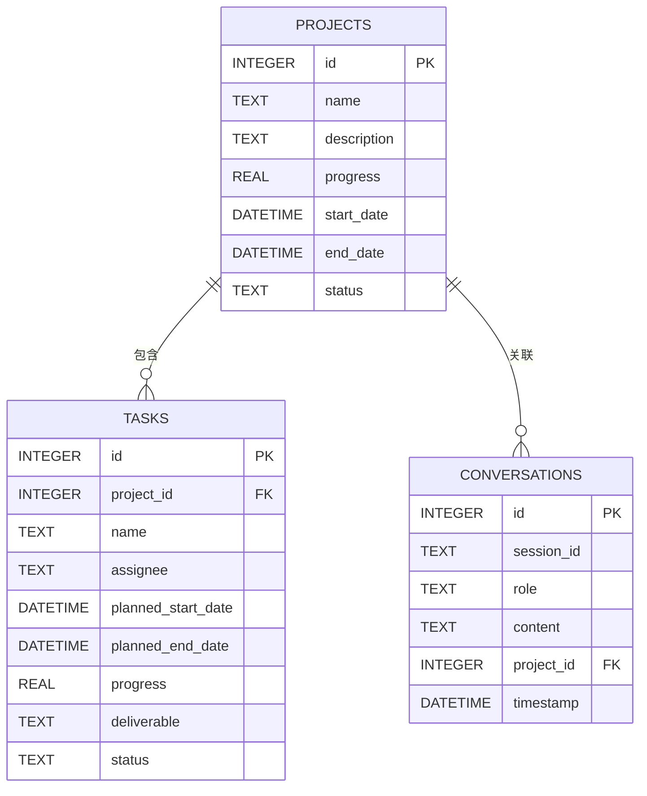

# 项目管理助手机器人 - 完整设计方案

## 项目概述

一个基于前后端分离架构的项目管理助手机器人，用户通过自然语言对话与AI交互，系统自动从对话中提取项目信息并整理成结构化数据，支持甘特图可视化展示。

### 核心功能
- 🤖 AI对话：支持自然语言交互，智能理解用户意图
- 📊 项目信息提取：自动从对话中提取项目、任务、时间、负责人等信息
- 📅 甘特图展示：可视化展示项目进度和时间安排
- ⚙️ 多LLM支持：支持OpenAI、Kimi、豆包等多种大模型
- 💾 本地存储：使用SQLite本地数据库，单机即可运行

---

## 系统架构

```
┌─────────────────────────────────────────────────────────────────┐
│                         客户端层                                 │
│  ┌─────────────────────────────────────────────────────────┐   │
│  │  React + TypeScript + Vite + Ant Design + ECharts      │   │
│  │  - 聊天界面  │  项目表格  │  甘特图  │  配置界面         │   │
│  └─────────────────────────────────────────────────────────┘   │
└─────────────────────────────────────────────────────────────────┘
                              │ HTTP/WebSocket
                              ▼
┌─────────────────────────────────────────────────────────────────┐
│                         服务端层                                 │
│  ┌─────────────────────────────────────────────────────────┐   │
│  │  Python FastAPI + SQLAlchemy + Pydantic                 │   │
│  │  - API路由  │  业务服务  │  LLM适配器  │  数据访问层    │   │
│  └─────────────────────────────────────────────────────────┘   │
└─────────────────────────────────────────────────────────────────┘
                              │
                              ▼
┌─────────────────────────────────────────────────────────────────┐
│                         数据层                                   │
│  ┌─────────────┐  ┌─────────────┐  ┌─────────────────────────┐ │
│  │  SQLite     │  │  .env       │  │  外部LLM API            │ │
│  │  (本地数据库)│  │  (API Key)  │  │  OpenAI/Kimi/豆包       │ │
│  └─────────────┘  └─────────────┘  └─────────────────────────┘ │
└─────────────────────────────────────────────────────────────────┘
```

---

## 技术栈

### 前端
| 技术 | 版本 | 用途 |
|------|------|------|
| React | 18.x | UI框架 |
| TypeScript | 5.x | 类型系统 |
| Vite | 5.x | 构建工具 |
| Ant Design | 5.x | UI组件库 |
| Zustand | 4.x | 状态管理 |
| ECharts | 5.x | 甘特图绘制 |
| Axios | 1.x | HTTP客户端 |

### 后端
| 技术 | 版本 | 用途 |
|------|------|------|
| Python | 3.10+ | 编程语言 |
| FastAPI | 0.104+ | Web框架 |
| SQLAlchemy | 2.x | ORM框架 |
| Pydantic | 2.x | 数据验证 |
| python-dotenv | 1.x | 环境变量管理 |
| httpx | 0.25+ | 异步HTTP客户端 |

### 数据库
| 技术 | 用途 |
|------|------|
| SQLite | 本地数据存储 |

---

## 数据库设计

### 实体关系图


### 核心表结构

#### 项目表 (projects)
| 字段 | 类型 | 说明 |
|------|------|------|
| id | INTEGER | 主键，自增 |
| name | TEXT | 项目名称 |
| description | TEXT | 项目描述 |
| progress | REAL | 总体进度(0-100) |
| start_date | DATETIME | 开始时间 |
| end_date | DATETIME | 结束时间 |
| status | TEXT | 状态: pending/active/completed/delayed |

#### 任务表 (tasks)
| 字段 | 类型 | 说明 |
|------|------|------|
| id | INTEGER | 主键，自增 |
| project_id | INTEGER | 所属项目ID |
| name | TEXT | 任务名称 |
| assignee | TEXT | 负责人 |
| planned_start_date | DATETIME | 计划开始时间 |
| planned_end_date | DATETIME | 计划结束时间 |
| actual_start_date | DATETIME | 实际开始时间 |
| actual_end_date | DATETIME | 实际结束时间 |
| progress | REAL | 完成进度(0-100) |
| deliverable | TEXT | 交付物描述 |
| status | TEXT | 状态 |
| priority | INTEGER | 优先级: 1-高, 2-中, 3-低 |

#### 对话表 (conversations)
| 字段 | 类型 | 说明 |
|------|------|------|
| id | INTEGER | 主键，自增 |
| session_id | TEXT | 会话ID |
| role | TEXT | 角色: user/assistant/system |
| content | TEXT | 消息内容 |
| project_id | INTEGER | 关联项目ID(可选) |
| timestamp | DATETIME | 时间戳 |

---

## API接口设计

### 聊天接口
| 方法 | 路径 | 说明 |
|------|------|------|
| POST | `/api/v1/chat/messages` | 发送消息 |
| POST | `/api/v1/chat/messages/stream` | 流式发送消息 |
| GET | `/api/v1/chat/history` | 获取对话历史 |

### 项目接口
| 方法 | 路径 | 说明 |
|------|------|------|
| GET | `/api/v1/projects` | 获取项目列表 |
| POST | `/api/v1/projects` | 创建项目 |
| GET | `/api/v1/projects/{id}` | 获取项目详情 |
| PUT | `/api/v1/projects/{id}` | 更新项目 |
| DELETE | `/api/v1/projects/{id}` | 删除项目 |

### 任务接口
| 方法 | 路径 | 说明 |
|------|------|------|
| GET | `/api/v1/projects/{id}/tasks` | 获取任务列表 |
| POST | `/api/v1/projects/{id}/tasks` | 创建任务 |
| PUT | `/api/v1/projects/{id}/tasks/{task_id}` | 更新任务 |
| DELETE | `/api/v1/projects/{id}/tasks/{task_id}` | 删除任务 |

### 甘特图接口
| 方法 | 路径 | 说明 |
|------|------|------|
| GET | `/api/v1/projects/{id}/gantt` | 获取甘特图数据 |

### 配置接口
| 方法 | 路径 | 说明 |
|------|------|------|
| GET | `/api/v1/config` | 获取配置 |
| PUT | `/api/v1/config` | 更新配置 |
| POST | `/api/v1/config/validate` | 验证API Key |

---

## 界面设计

### 主界面布局
```
┌─────────────────────────────────────────────────────────────────┐
│  [Logo] 项目管理助手                    [设置]  [帮助]          │  ← Header
├───────────────┬───────────────────────────────┬─────────────────┤
│               │                               │                 │
│   聊天区域    │        项目信息/甘特图区域     │   详情侧边栏    │
│   (350px)     │        (自适应宽度)            │   (300px)       │
│               │                               │                 │
│ ┌───────────┐ │ ┌───────────────────────────┐ │ ┌─────────────┐ │
│ │ AI消息    │ │ │                           │ │ │ 项目详情    │ │
│ │ [头像]    │ │ │    项目甘特图/任务列表     │ │ │ ─────────── │ │
│ │ 你好！    │ │ │                           │ │ │ 名称: XXX   │ │
│ │           │ │ │ [项目A][项目B][项目C]     │ │ │ 进度: 75%   │ │
│ └───────────┘ │ │                           │ │ │ 状态: 进行中│ │
│               │ │ ┌───────────────────────┐ │ │ │             │ │
│ ┌───────────┐ │ │ │   甘特图/表格视图     │ │ │ │ 子任务列表  │ │
│ │ 用户消息  │ │ │ │   ═══════════════     │ │ │ │ ─────────── │ │
│ │ 帮我查看  │ │ │ │   │任务A│██████░░│   │ │ │ │ □ 任务1     │ │
│ │ 项目进度  │ │ │ │   │任务B│████████│   │ │ │ │ □ 任务2     │ │
│ └───────────┘ │ │ │   ═══════════════     │ │ │ └─────────────┘ │
│               │ │ └───────────────────────┘ │ │                 │
│ ┌───────────┐ │ │                           │ │                 │
│ │ [输入...] │ │ │ [甘特图 | 列表 | 看板]     │ │                 │
│ │ [发送]    │ │ │                           │ │                 │
│ └───────────┘ │ └───────────────────────────┘ │                 │
│               │                               │                 │
└───────────────┴───────────────────────────────┴─────────────────┘
```

### 配置界面
```
┌─────────────────────────────────────────────────────────────────┐
│                        系统配置                                  │
├─────────────────────────────────────────────────────────────────┤
│                                                                 │
│  LLM提供商                                                      │
│  ┌─────────┐ ┌─────────┐ ┌─────────┐                           │
│  │ OpenAI  │ │  Kimi   │ │  豆包   │                           │
│  │   ●     │ │    ○    │ │    ○    │                           │
│  └─────────┘ └─────────┘ └─────────┘                           │
│                                                                 │
│  API配置                                                        │
│  ┌─────────────────────────────────────────────────────────┐   │
│  │ Base URL: [https://api.openai.com/v1            ]       │   │
│  │ API Key:  [sk-***********************************]       │   │
│  │ Model:    [gpt-4-turbo                           ] [▼]  │   │
│  └─────────────────────────────────────────────────────────┘   │
│                                                                 │
│  高级设置                                                        │
│  ┌─────────────────────────────────────────────────────────┐   │
│  │ Temperature: [0.5 ----●---- 1.0]                        │   │
│  │ Max Tokens:  [2000    ]                                 │   │
│  └─────────────────────────────────────────────────────────┘   │
│                                                                 │
│  ┌─────────────┐  ┌─────────────┐                              │
│  │  测试连接   │  │  保存配置   │                              │
│  └─────────────┘  └─────────────┘                              │
│                                                                 │
└─────────────────────────────────────────────────────────────────┘
```

---

## LLM集成设计

### 支持的提供商
| 提供商 | Base URL | 特点 |
|--------|----------|------|
| OpenAI | https://api.openai.com/v1 | 功能全面 |
| Kimi | https://api.moonshot.cn/v1 | 中文优化 |
| 豆包 | https://ark.cn-beijing.volces.com/api/v3 | 性价比高 |

### 统一接口
```python
class LLMProviderInterface(ABC):
    @abstractmethod
    def chat(self, messages: List[Message], config: LLMConfig) -> LLMResponse:
        pass
    
    @abstractmethod
    def chat_stream(self, messages: List[Message], config: LLMConfig) -> Iterator[ResponseChunk]:
        pass
    
    @abstractmethod
    def extract_project_info(self, text: str, config: LLMConfig) -> ProjectInfo:
        pass
```

### 项目信息提取Prompt
```yaml
system: |
  你是一个项目信息提取专家。从用户输入中提取项目相关信息，并以JSON格式输出。
  
  ## 提取字段
  - name: 项目名称
  - description: 项目描述
  - start_date: 开始日期 (YYYY-MM-DD)
  - end_date: 结束日期 (YYYY-MM-DD)
  - intent: 用户意图 (create/update/query/unknown)
  - tasks: 任务列表，每个任务包含：
    - name: 任务名称
    - start_date: 开始日期
    - end_date: 结束日期
    - assignee: 负责人
    - priority: 优先级 (high/medium/low)
  
  ## 输出格式
  必须输出有效的JSON，不要包含任何其他文字。
```

---

## 项目目录结构

```
project-assistant/
├── README.md
├── .env                      # 环境变量（API Key等）
├── .env.example              # 环境变量示例
├── requirements.txt          # Python依赖
├── start.sh                  # 启动脚本
│
├── backend/                  # 后端代码
│   ├── main.py               # FastAPI入口
│   ├── api/                  # API路由
│   │   ├── chat.py
│   │   ├── project.py
│   │   ├── task.py
│   │   ├── gantt.py
│   │   └── config.py
│   ├── core/                 # 业务逻辑
│   │   ├── chat_service.py
│   │   ├── project_service.py
│   │   ├── extractor.py
│   │   └── config_service.py
│   ├── llm/                  # LLM适配器
│   │   ├── base.py
│   │   ├── openai_client.py
│   │   ├── kimi_client.py
│   │   ├── doubao_client.py
│   │   └── factory.py
│   ├── models/               # 数据模型
│   │   ├── database.py
│   │   ├── schemas.py
│   │   └── entities.py
│   └── utils/                # 工具函数
│       └── helpers.py
│
├── frontend/                 # 前端代码
│   ├── package.json
│   ├── vite.config.ts
│   ├── tsconfig.json
│   └── src/
│       ├── main.tsx
│       ├── App.tsx
│       ├── components/       # 组件
│       │   ├── layout/
│       │   ├── chat/
│       │   ├── project/
│       │   ├── gantt/
│       │   └── config/
│       ├── hooks/            # 自定义Hooks
│       ├── store/            # 状态管理
│       ├── services/         # API服务
│       ├── types/            # TypeScript类型
│       └── utils/            # 工具函数
│
└── data/                     # 数据目录
    └── .gitkeep
```

---

## 环境变量配置

### .env 文件示例
```bash
# LLM配置
DEFAULT_LLM_PROVIDER=openai

# OpenAI
OPENAI_API_KEY=your_openai_api_key
OPENAI_MODEL=gpt-4-turbo
OPENAI_BASE_URL=https://api.openai.com/v1

# Kimi
KIMI_API_KEY=your_kimi_api_key
KIMI_MODEL=moonshot-v1-8k
KIMI_BASE_URL=https://api.moonshot.cn/v1

# 豆包
DOUBAO_API_KEY=your_doubao_api_key
DOUBAO_MODEL=doubao-pro-32k
DOUBAO_BASE_URL=https://ark.cn-beijing.volces.com/api/v3

# 应用配置
APP_NAME=Project Assistant
DEBUG=false
DATABASE_URL=sqlite:///./data/app.db
```

---

## 开发计划

### 第一阶段：MVP (1周)
- [x] 基础聊天功能
- [x] 项目信息提取
- [x] 项目表格展示
- [x] SQLite数据存储

### 第二阶段：V1.0 (1周)
- [x] 甘特图展示
- [x] 多LLM支持
- [x] 配置界面
- [x] 流式响应

### 第三阶段：V1.1 (3天)
- [x] 提取准确性优化
- [x] UI美化
- [x] 性能优化

---

## 详细设计文档

详细设计文档已分别保存在以下文件中：
- `/mnt/okcomputer/output/design_architecture.md` - 系统架构设计
- `/mnt/okcomputer/output/design_frontend.md` - 前端UI/UX设计
- `/mnt/okcomputer/output/design_backend.md` - 后端API设计
- `/mnt/okcomputer/output/design_database.md` - 数据库设计
- `/mnt/okcomputer/output/design_ai_integration.md` - AI集成设计

---

*文档版本: v1.0*
*生成日期: 2025-01-30*
