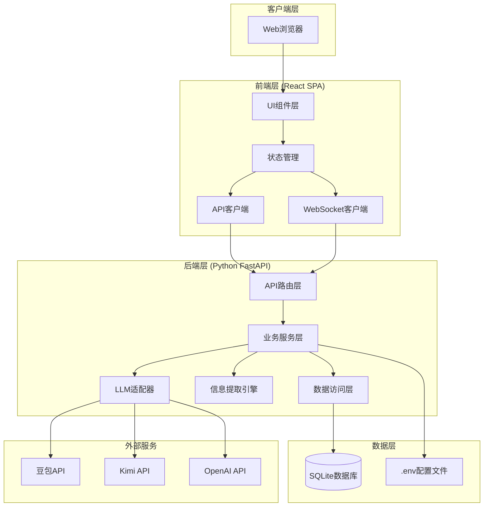
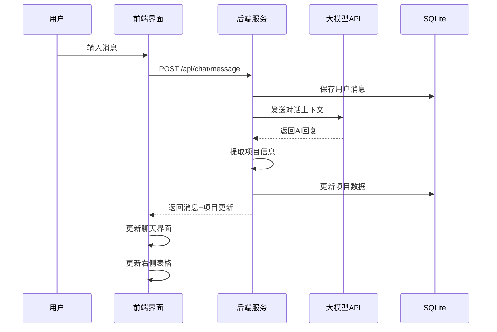
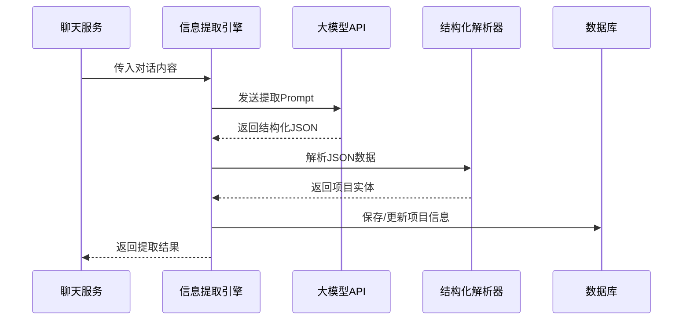
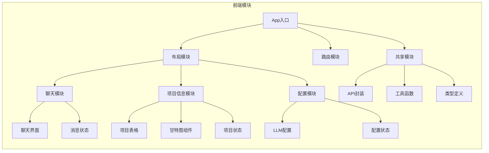
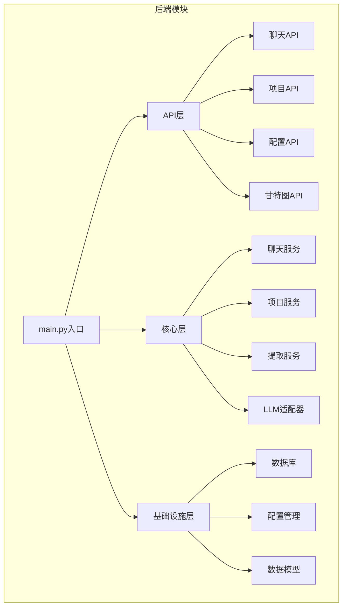
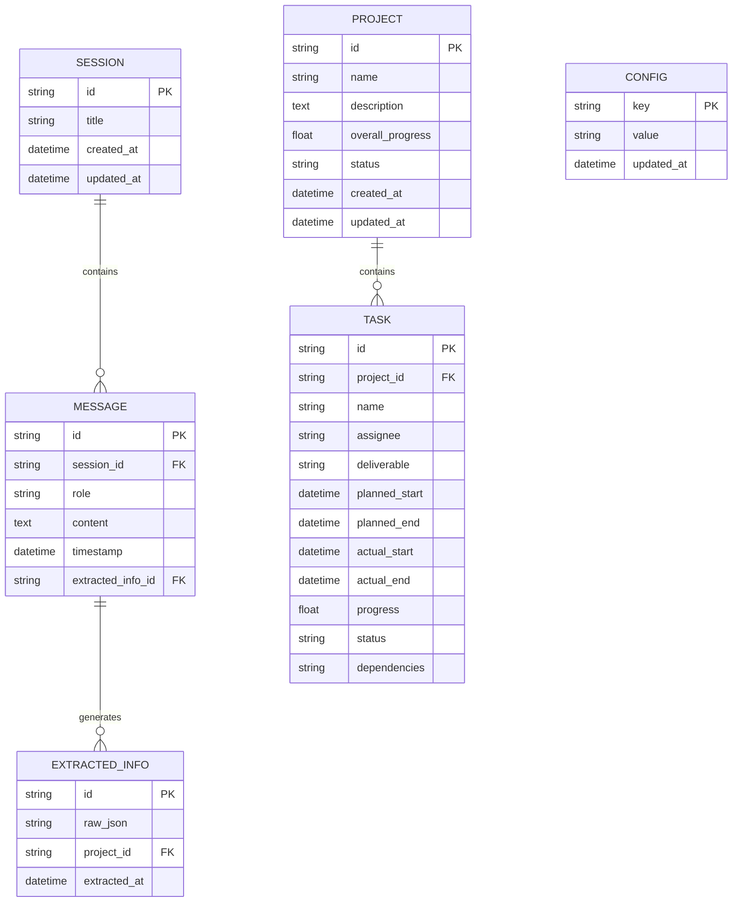
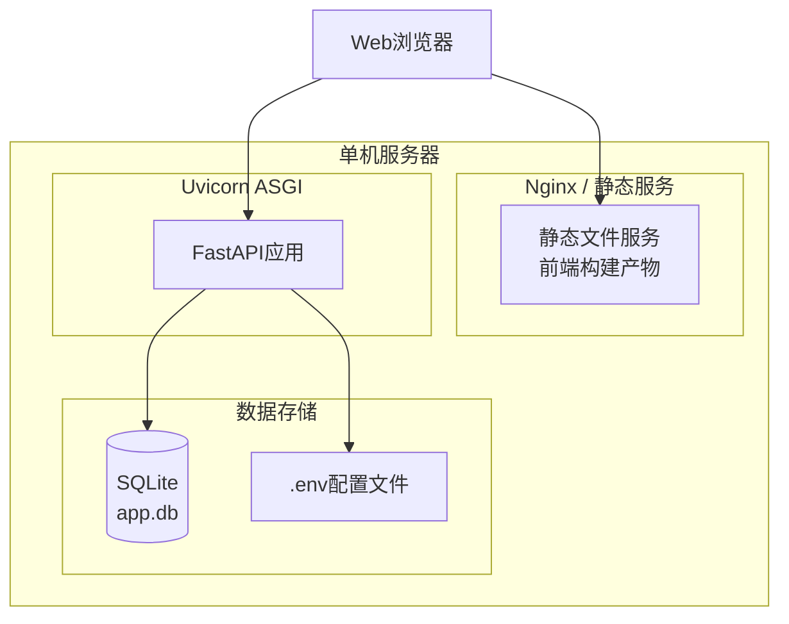

# 项目管理助手机器人 - 系统架构设计文档

## 版本信息
- **版本**: v1.0
- **日期**: 2025-01-15
- **作者**: 系统架构师

---

## 目录
1. [整体架构概述](#1-整体架构概述)
2. [技术栈选型](#2-技术栈选型)
3. [模块划分与职责](#3-模块划分与职责)
4. [前后端通信协议](#4-前后端通信协议)
5. [数据库设计](#5-数据库设计)
6. [系统部署架构](#6-系统部署架构)
7. [目录结构建议](#7-目录结构建议)
8. [安全设计](#8-安全设计)
9. [扩展性设计](#9-扩展性设计)

---

## 1. 整体架构概述

### 1.1 架构风格
本项目采用 **前后端分离** 的单体架构，适合单机部署运行。

### 1.2 整体架构图



### 1.3 核心流程图

#### 聊天交互流程


#### 项目信息提取流程


---

## 2. 技术栈选型

### 2.1 前端技术栈

| 技术 | 版本 | 用途 | 选型理由 |
|------|------|------|----------|
| **React** | 18.x | UI框架 | 生态成熟，组件化开发，社区活跃 |
| **TypeScript** | 5.x | 类型系统 | 强类型保证，提升代码质量和可维护性 |
| **Vite** | 5.x | 构建工具 | 快速冷启动，HMR支持，配置简单 |
| **Ant Design** | 5.x | UI组件库 | 企业级组件，表格/表单功能强大 |
| **Zustand** | 4.x | 状态管理 | 轻量级，TypeScript友好，学习成本低 |
| **React Query** | 5.x | 服务端状态 | 数据获取、缓存、同步管理 |
| **ECharts** | 5.x | 甘特图绘制 | 功能强大，支持自定义，文档完善 |
| **Axios** | 1.x | HTTP客户端 | 拦截器支持，请求取消，TypeScript支持 |

### 2.2 后端技术栈

| 技术 | 版本 | 用途 | 选型理由 |
|------|------|------|----------|
| **Python** | 3.10+ | 编程语言 | AI生态丰富，开发效率高 |
| **FastAPI** | 0.104+ | Web框架 | 异步支持，自动生成文档，性能优秀 |
| **SQLAlchemy** | 2.x | ORM框架 | 强大的ORM，支持异步，迁移工具完善 |
| **Alembic** | 1.x | 数据库迁移 | SQLAlchemy官方迁移工具 |
| **Pydantic** | 2.x | 数据验证 | FastAPI原生集成，类型安全 |
| **python-dotenv** | 1.x | 环境变量 | 管理.env配置文件 |
| **httpx** | 0.25+ | HTTP客户端 | 异步HTTP请求，支持HTTP/2 |
| **uvicorn** | 0.24+ | ASGI服务器 | 高性能异步服务器 |

### 2.3 数据库选型

| 技术 | 用途 | 选型理由 |
|------|------|----------|
| **SQLite** | 本地数据库 | 零配置，单文件存储，适合单机部署 |

### 2.4 LLM集成

| 提供商 | SDK/调用方式 |
|--------|-------------|
| **豆包** | HTTP API调用 |
| **Kimi** | HTTP API调用 |
| **OpenAI** | openai SDK / HTTP API |

---

## 3. 模块划分与职责

### 3.1 前端模块划分



#### 模块职责说明

| 模块 | 职责 | 核心组件 |
|------|------|----------|
| **布局模块** | 整体页面布局，左右分栏 | MainLayout, Sidebar |
| **聊天模块** | 消息收发、历史记录、输入处理 | ChatWindow, MessageList, InputBox |
| **项目信息模块** | 项目数据展示、甘特图渲染 | ProjectTable, GanttChart, TaskDetail |
| **配置模块** | LLM配置界面、API Key管理 | ConfigForm, ModelSelector |
| **共享模块** | 工具函数、类型定义、API封装 | api.ts, types.ts, utils.ts |

### 3.2 后端模块划分



#### 模块职责说明

| 模块 | 职责 | 核心文件/类 |
|------|------|-------------|
| **API层** | HTTP路由定义、请求处理、响应格式化 | chat.py, project.py, config.py |
| **聊天服务** | 消息处理、对话管理、上下文维护 | chat_service.py, ChatService |
| **项目服务** | 项目CRUD、任务管理、进度计算 | project_service.py, ProjectService |
| **提取服务** | 从对话中提取项目信息 | extractor_service.py, ExtractorService |
| **LLM适配器** | 统一封装不同LLM API调用 | llm_adapter.py, DoubaoClient, KimiClient, OpenAIClient |
| **数据访问层** | 数据库操作、ORM模型 | models.py, database.py |
| **配置管理** | 读取.env、配置验证 | config.py, Settings |

---

## 4. 前后端通信协议

### 4.1 API设计规范

- **协议**: HTTP/1.1 或 HTTP/2
- **数据格式**: JSON
- **编码**: UTF-8
- **Content-Type**: `application/json`

### 4.2 RESTful API 列表

#### 聊天相关 API

| 方法 | 路径 | 描述 | 请求体 | 响应 |
|------|------|------|--------|------|
| POST | `/api/chat/messages` | 发送消息 | `{content: string, session_id?: string}` | ChatMessage |
| GET | `/api/chat/sessions` | 获取会话列表 | - | Session[] |
| GET | `/api/chat/sessions/{id}/messages` | 获取会话消息 | - | ChatMessage[] |
| DELETE | `/api/chat/sessions/{id}` | 删除会话 | - | - |

#### 项目相关 API

| 方法 | 路径 | 描述 | 请求体 | 响应 |
|------|------|------|--------|------|
| GET | `/api/projects` | 获取所有项目 | - | Project[] |
| GET | `/api/projects/{id}` | 获取项目详情 | - | Project |
| PUT | `/api/projects/{id}` | 更新项目 | ProjectUpdate | Project |
| DELETE | `/api/projects/{id}` | 删除项目 | - | - |
| GET | `/api/projects/{id}/tasks` | 获取项目任务 | - | Task[] |
| PUT | `/api/tasks/{id}` | 更新任务 | TaskUpdate | Task |

#### 甘特图相关 API

| 方法 | 路径 | 描述 | 请求体 | 响应 |
|------|------|------|--------|------|
| GET | `/api/gantt/projects` | 获取所有项目甘特图数据 | - | GanttData |
| GET | `/api/gantt/projects/{id}` | 获取单个项目甘特图数据 | - | GanttData |

#### 配置相关 API

| 方法 | 路径 | 描述 | 请求体 | 响应 |
|------|------|------|--------|------|
| GET | `/api/config` | 获取配置（不含敏感信息） | - | Config |
| PUT | `/api/config` | 更新配置 | ConfigUpdate | Config |
| POST | `/api/config/test` | 测试LLM连接 | `{provider: string, api_key: string}` | TestResult |

### 4.3 数据模型定义

#### 请求/响应模型 (Pydantic)

```python
# 聊天相关
class ChatMessageCreate(BaseModel):
    content: str
    session_id: Optional[str] = None

class ChatMessageResponse(BaseModel):
    id: str
    role: Literal["user", "assistant"]
    content: str
    timestamp: datetime
    extracted_info: Optional[ExtractedInfo] = None

# 项目相关
class ProjectResponse(BaseModel):
    id: str
    name: str
    description: Optional[str]
    overall_progress: float  # 0-100
    status: ProjectStatus
    created_at: datetime
    updated_at: datetime
    tasks: List[TaskResponse]

class TaskResponse(BaseModel):
    id: str
    project_id: str
    name: str
    assignee: Optional[str]
    deliverable: Optional[str]
    planned_start: Optional[datetime]
    planned_end: Optional[datetime]
    actual_start: Optional[datetime]
    actual_end: Optional[datetime]
    progress: float  # 0-100
    status: TaskStatus
    dependencies: List[str]  # 依赖任务ID列表

# 甘特图数据
class GanttData(BaseModel):
    projects: List[GanttProject]
    tasks: List[GanttTask]
    dependencies: List[GanttDependency]

# 配置相关
class ConfigResponse(BaseModel):
    default_provider: str  # doubao, kimi, openai
    model_name: str
    # api_key 不返回

class ConfigUpdate(BaseModel):
    default_provider: Optional[str] = None
    model_name: Optional[str] = None
    api_key: Optional[str] = None
```

### 4.4 WebSocket 设计

用于实时推送项目信息更新：

| 事件 | 方向 | 描述 | 数据 |
|------|------|------|------|
| `connect` | C->S | 建立连接 | - |
| `message` | C->S | 发送消息 | `{content: string}` |
| `message_stream` | S->C | 流式回复 | `{chunk: string}` |
| `project_update` | S->C | 项目更新 | Project |
| `task_update` | S->C | 任务更新 | Task |
| `disconnect` | C->S | 断开连接 | - |

---

## 5. 数据库设计

### 5.1 ER图



### 5.2 表结构定义

```sql
-- 会话表
CREATE TABLE sessions (
    id TEXT PRIMARY KEY,
    title TEXT NOT NULL,
    created_at TIMESTAMP DEFAULT CURRENT_TIMESTAMP,
    updated_at TIMESTAMP DEFAULT CURRENT_TIMESTAMP
);

-- 消息表
CREATE TABLE messages (
    id TEXT PRIMARY KEY,
    session_id TEXT NOT NULL,
    role TEXT NOT NULL CHECK (role IN ('user', 'assistant')),
    content TEXT NOT NULL,
    timestamp TIMESTAMP DEFAULT CURRENT_TIMESTAMP,
    extracted_info_id TEXT,
    FOREIGN KEY (session_id) REFERENCES sessions(id)
);

-- 提取信息表
CREATE TABLE extracted_infos (
    id TEXT PRIMARY KEY,
    raw_json TEXT NOT NULL,
    project_id TEXT,
    extracted_at TIMESTAMP DEFAULT CURRENT_TIMESTAMP
);

-- 项目表
CREATE TABLE projects (
    id TEXT PRIMARY KEY,
    name TEXT NOT NULL,
    description TEXT,
    overall_progress REAL DEFAULT 0 CHECK (overall_progress >= 0 AND overall_progress <= 100),
    status TEXT DEFAULT 'active' CHECK (status IN ('active', 'completed', 'paused', 'cancelled')),
    created_at TIMESTAMP DEFAULT CURRENT_TIMESTAMP,
    updated_at TIMESTAMP DEFAULT CURRENT_TIMESTAMP
);

-- 任务表
CREATE TABLE tasks (
    id TEXT PRIMARY KEY,
    project_id TEXT NOT NULL,
    name TEXT NOT NULL,
    assignee TEXT,
    deliverable TEXT,
    planned_start TIMESTAMP,
    planned_end TIMESTAMP,
    actual_start TIMESTAMP,
    actual_end TIMESTAMP,
    progress REAL DEFAULT 0 CHECK (progress >= 0 AND progress <= 100),
    status TEXT DEFAULT 'pending' CHECK (status IN ('pending', 'in_progress', 'completed', 'blocked')),
    dependencies TEXT, -- JSON数组存储依赖任务ID
    FOREIGN KEY (project_id) REFERENCES projects(id)
);

-- 配置表
CREATE TABLE configs (
    key TEXT PRIMARY KEY,
    value TEXT NOT NULL,
    updated_at TIMESTAMP DEFAULT CURRENT_TIMESTAMP
);
```

---

## 6. 系统部署架构

### 6.1 单机部署架构



### 6.2 部署方式

#### 方式一：开发模式

```bash
# 后端
uvicorn main:app --reload --host 0.0.0.0 --port 8000

# 前端 (另一个终端)
npm run dev
```

#### 方式二：生产模式

```bash
# 1. 构建前端
cd frontend && npm run build

# 2. 配置静态文件服务（Nginx或直接由FastAPI提供）
# 3. 启动后端服务
uvicorn main:app --host 0.0.0.0 --port 8000
```

### 6.3 启动脚本

```bash
#!/bin/bash
# start.sh - 项目启动脚本

# 检查环境
if [ ! -f ".env" ]; then
    echo "警告: .env 文件不存在，请创建配置文件"
    exit 1
fi

# 初始化数据库
python -c "from database import init_db; init_db()"

# 启动服务
uvicorn main:app --host 0.0.0.0 --port 8000
```

---

## 7. 目录结构建议

### 7.1 整体目录结构

```
project-assistant/
├── README.md
├── requirements.txt          # Python依赖
├── .env                      # 环境变量配置
├── .env.example              # 环境变量示例
├── start.sh                  # 启动脚本
├── init_db.py                # 数据库初始化
├── main.py                   # 后端入口
├── pyproject.toml            # Python项目配置
│
├── backend/                  # 后端代码
│   ├── __init__.py
│   ├── api/                  # API路由
│   │   ├── __init__.py
│   │   ├── chat.py           # 聊天API
│   │   ├── project.py        # 项目API
│   │   ├── gantt.py          # 甘特图API
│   │   └── config.py         # 配置API
│   │
│   ├── core/                 # 核心业务逻辑
│   │   ├── __init__.py
│   │   ├── chat_service.py   # 聊天服务
│   │   ├── project_service.py # 项目服务
│   │   ├── extractor.py      # 信息提取引擎
│   │   └── config_service.py # 配置服务
│   │
│   ├── llm/                  # LLM适配器
│   │   ├── __init__.py
│   │   ├── base.py           # 基类定义
│   │   ├── doubao.py         # 豆包适配器
│   │   ├── kimi.py           # Kimi适配器
│   │   ├── openai_client.py  # OpenAI适配器
│   │   └── factory.py        # 工厂类
│   │
│   ├── models/               # 数据模型
│   │   ├── __init__.py
│   │   ├── database.py       # 数据库连接
│   │   ├── schemas.py        # Pydantic模型
│   │   └── entities.py       # SQLAlchemy模型
│   │
│   └── utils/                # 工具函数
│       ├── __init__.py
│       ├── logger.py         # 日志配置
│       └── helpers.py        # 辅助函数
│
├── frontend/                 # 前端代码
│   ├── package.json
│   ├── tsconfig.json
│   ├── vite.config.ts
│   ├── index.html
│   │
│   ├── src/
│   │   ├── main.tsx          # 入口文件
│   │   ├── App.tsx           # 根组件
│   │   ├── vite-env.d.ts
│   │   │
│   │   ├── api/              # API封装
│   │   │   ├── index.ts
│   │   │   ├── chat.ts
│   │   │   ├── project.ts
│   │   │   └── config.ts
│   │   │
│   │   ├── components/       # 组件
│   │   │   ├── layout/       # 布局组件
│   │   │   │   ├── MainLayout.tsx
│   │   │   │   ├── ChatPanel.tsx
│   │   │   │   └── ProjectPanel.tsx
│   │   │   │
│   │   │   ├── chat/         # 聊天组件
│   │   │   │   ├── ChatWindow.tsx
│   │   │   │   ├── MessageList.tsx
│   │   │   │   ├── MessageItem.tsx
│   │   │   │   └── InputBox.tsx
│   │   │   │
│   │   │   ├── project/      # 项目组件
│   │   │   │   ├── ProjectTable.tsx
│   │   │   │   ├── TaskDetail.tsx
│   │   │   │   └── GanttChart.tsx
│   │   │   │
│   │   │   ├── config/       # 配置组件
│   │   │   │   └── ConfigModal.tsx
│   │   │   │
│   │   │   └── common/       # 通用组件
│   │   │       └── Loading.tsx
│   │   │
│   │   ├── hooks/            # 自定义Hooks
│   │   │   ├── useChat.ts
│   │   │   ├── useProject.ts
│   │   │   └── useConfig.ts
│   │   │
│   │   ├── stores/           # 状态管理
│   │   │   ├── chatStore.ts
│   │   │   ├── projectStore.ts
│   │   │   └── configStore.ts
│   │   │
│   │   ├── types/            # 类型定义
│   │   │   ├── index.ts
│   │   │   ├── chat.ts
│   │   │   ├── project.ts
│   │   │   └── config.ts
│   │   │
│   │   └── utils/            # 工具函数
│   │       ├── format.ts
│   │       └── constants.ts
│   │
│   └── public/               # 静态资源
│       └── favicon.ico
│
├── data/                     # 数据目录
│   └── .gitkeep
│
└── docs/                     # 文档
    └── architecture.md
```

### 7.2 关键文件说明

| 文件/目录 | 说明 |
|-----------|------|
| `main.py` | FastAPI应用入口，注册路由和中间件 |
| `.env` | 环境变量，包含API Key等敏感信息（不提交Git） |
| `backend/api/` | RESTful API路由定义 |
| `backend/core/extractor.py` | 核心：从对话中提取项目信息 |
| `backend/llm/` | LLM适配器，支持多提供商切换 |
| `frontend/src/components/` | React组件，按功能分类 |
| `frontend/src/stores/` | Zustand状态管理 |

---

## 8. 安全设计

### 8.1 安全措施

| 层面 | 措施 | 说明 |
|------|------|------|
| **API Key** | 存储在.env | 不提交代码库，运行时读取 |
| **CORS** | 配置跨域 | 限制允许的源 |
| **输入验证** | Pydantic | 所有请求数据验证 |
| **SQL注入** | SQLAlchemy ORM | 参数化查询 |
| **XSS** | React默认转义 | 自动转义HTML |

### 8.2 CORS配置

```python
from fastapi.middleware.cors import CORSMiddleware

app.add_middleware(
    CORSMiddleware,
    allow_origins=["http://localhost:5173"],  # 开发环境
    allow_credentials=True,
    allow_methods=["*"],
    allow_headers=["*"],
)
```

---

## 9. 扩展性设计

### 9.1 扩展点

| 扩展点 | 设计 |
|--------|------|
| **新LLM提供商** | 继承BaseLLMClient，实现新适配器 |
| **新提取字段** | 修改Pydantic模型和提取Prompt |
| **新图表类型** | 添加新API端点和前端组件 |
| **多用户支持** | 添加用户表和权限中间件 |

### 9.2 LLM适配器扩展

```python
# backend/llm/base.py
from abc import ABC, abstractmethod

class BaseLLMClient(ABC):
    @abstractmethod
    async def chat(self, messages: list, **kwargs) -> str:
        pass
    
    @abstractmethod
    async def chat_stream(self, messages: list, **kwargs):
        pass

# backend/llm/factory.py
class LLMFactory:
    @staticmethod
    def create(provider: str, api_key: str) -> BaseLLMClient:
        if provider == "doubao":
            return DoubaoClient(api_key)
        elif provider == "kimi":
            return KimiClient(api_key)
        elif provider == "openai":
            return OpenAIClient(api_key)
        raise ValueError(f"Unknown provider: {provider}")
```

---

## 10. 开发计划建议

### 10.1 迭代计划

| 阶段 | 内容 | 预计时间 |
|------|------|----------|
| **MVP** | 基础聊天、项目表格、SQLite存储 | 1周 |
| **V1.0** | 甘特图、多LLM支持、配置界面 | 1周 |
| **V1.1** | 优化提取准确性、UI美化 | 3天 |

### 10.2 关键技术决策

1. **信息提取策略**: 使用Few-shot Prompt + JSON Schema约束
2. **甘特图渲染**: ECharts Gantt 或自定义SVG
3. **实时更新**: WebSocket推送或轮询

---

## 附录

### A. 环境变量示例 (.env.example)

```bash
# LLM配置
DEFAULT_LLM_PROVIDER=doubao
DOUBAO_API_KEY=your_doubao_api_key
DOUBAO_MODEL=your_model_name

KIMI_API_KEY=your_kimi_api_key
KIMI_MODEL=moonshot-v1-8k

OPENAI_API_KEY=your_openai_api_key
OPENAI_MODEL=gpt-3.5-turbo

# 应用配置
APP_NAME=Project Assistant
DEBUG=false
DATABASE_URL=sqlite:///./data/app.db
```

### B. 信息提取Prompt模板

```
请从以下对话中提取项目信息，以JSON格式返回：

对话内容：
{conversation}

请提取以下字段：
- project_name: 项目名称
- description: 项目描述
- tasks: 任务列表，每个任务包含：
  - name: 任务名称
  - assignee: 负责人
  - deliverable: 交付物
  - planned_start: 计划开始时间 (YYYY-MM-DD)
  - planned_end: 计划结束时间 (YYYY-MM-DD)
  - progress: 完成进度 (0-100)

如果没有提取到某个字段，设为null。

返回格式必须是合法的JSON。
```

---

*文档结束*
