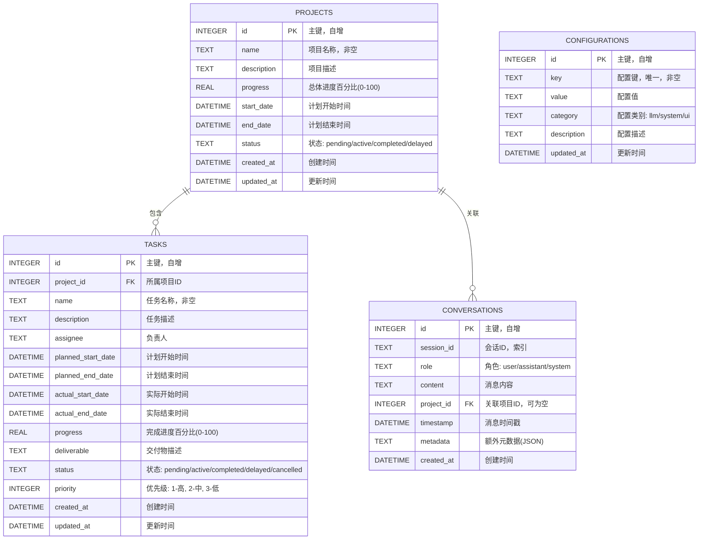

# 项目管理助手机器人 - 数据库设计文档

## 1. 概述

本文档描述了项目管理助手机器人的SQLite数据库设计，包含项目信息、子任务、对话历史和系统配置四个核心模块。

---

## 2. 实体关系图 (ERD)

### 2.1 Mermaid ERD



### 2.2 关系说明

| 关系 | 类型 | 描述 |
|------|------|------|
| PROJECTS → TASKS | 一对多 | 一个项目包含多个子任务 |
| PROJECTS → CONVERSATIONS | 一对多 | 一个项目可关联多条对话记录 |

---

## 3. 详细表结构设计

### 3.1 项目信息表 (projects)

存储项目的基本信息和进度状态。

| 字段名 | 类型 | 约束 | 默认值 | 说明 |
|--------|------|------|--------|------|
| id | INTEGER | PRIMARY KEY, AUTOINCREMENT | - | 主键，自增ID |
| name | TEXT | NOT NULL | - | 项目名称 |
| description | TEXT | - | NULL | 项目描述 |
| progress | REAL | CHECK(0<=progress AND progress<=100) | 0 | 总体进度百分比 |
| start_date | DATETIME | - | NULL | 计划开始时间 |
| end_date | DATETIME | - | NULL | 计划结束时间 |
| status | TEXT | CHECK(status IN (...)) | 'pending' | 项目状态 |
| created_at | DATETIME | NOT NULL | CURRENT_TIMESTAMP | 创建时间 |
| updated_at | DATETIME | NOT NULL | CURRENT_TIMESTAMP | 更新时间 |

**状态枚举值：**
- `pending`: 待开始
- `active`: 进行中
- `completed`: 已完成
- `delayed`: 已延期
- `cancelled`: 已取消

**索引：**
- `idx_projects_status`: 状态索引，用于按状态筛选
- `idx_projects_dates`: (start_date, end_date) 复合索引，用于时间范围查询

---

### 3.2 子任务信息表 (tasks)

存储项目下的具体任务信息。

| 字段名 | 类型 | 约束 | 默认值 | 说明 |
|--------|------|------|--------|------|
| id | INTEGER | PRIMARY KEY, AUTOINCREMENT | - | 主键，自增ID |
| project_id | INTEGER | NOT NULL, FOREIGN KEY | - | 所属项目ID |
| name | TEXT | NOT NULL | - | 任务名称 |
| description | TEXT | - | NULL | 任务描述 |
| assignee | TEXT | - | NULL | 负责人姓名 |
| planned_start_date | DATETIME | - | NULL | 计划开始时间 |
| planned_end_date | DATETIME | - | NULL | 计划结束时间 |
| actual_start_date | DATETIME | - | NULL | 实际开始时间 |
| actual_end_date | DATETIME | - | NULL | 实际结束时间 |
| progress | REAL | CHECK(0<=progress AND progress<=100) | 0 | 完成进度百分比 |
| deliverable | TEXT | - | NULL | 交付物描述 |
| status | TEXT | CHECK(status IN (...)) | 'pending' | 任务状态 |
| priority | INTEGER | CHECK(priority IN (1,2,3)) | 2 | 优先级 |
| created_at | DATETIME | NOT NULL | CURRENT_TIMESTAMP | 创建时间 |
| updated_at | DATETIME | NOT NULL | CURRENT_TIMESTAMP | 更新时间 |

**状态枚举值：**
- `pending`: 待开始
- `active`: 进行中
- `completed`: 已完成
- `delayed`: 已延期
- `cancelled`: 已取消

**优先级枚举值：**
- `1`: 高优先级
- `2`: 中优先级
- `3`: 低优先级

**索引：**
- `idx_tasks_project_id`: 项目ID索引，用于关联查询
- `idx_tasks_status`: 状态索引
- `idx_tasks_assignee`: 负责人索引
- `idx_tasks_priority`: 优先级索引

---

### 3.3 对话历史表 (conversations)

存储用户与AI的对话记录。

| 字段名 | 类型 | 约束 | 默认值 | 说明 |
|--------|------|------|--------|------|
| id | INTEGER | PRIMARY KEY, AUTOINCREMENT | - | 主键，自增ID |
| session_id | TEXT | NOT NULL | - | 会话唯一标识 |
| role | TEXT | NOT NULL, CHECK(role IN (...)) | - | 消息角色 |
| content | TEXT | NOT NULL | - | 消息内容 |
| project_id | INTEGER | FOREIGN KEY, NULLABLE | NULL | 关联项目ID |
| timestamp | DATETIME | NOT NULL | CURRENT_TIMESTAMP | 消息时间戳 |
| metadata | TEXT | - | NULL | 额外元数据(JSON格式) |
| created_at | DATETIME | NOT NULL | CURRENT_TIMESTAMP | 创建时间 |

**角色枚举值：**
- `user`: 用户消息
- `assistant`: AI助手回复
- `system`: 系统消息

**索引：**
- `idx_conversations_session_id`: 会话ID索引，用于会话历史查询
- `idx_conversations_project_id`: 项目ID索引
- `idx_conversations_timestamp`: 时间戳索引，用于时间排序

---

### 3.4 系统配置表 (configurations)

存储系统配置信息（不含API Key）。

| 字段名 | 类型 | 约束 | 默认值 | 说明 |
|--------|------|------|--------|------|
| id | INTEGER | PRIMARY KEY, AUTOINCREMENT | - | 主键，自增ID |
| key | TEXT | NOT NULL, UNIQUE | - | 配置键名 |
| value | TEXT | - | NULL | 配置值 |
| category | TEXT | CHECK(category IN (...)) | 'system' | 配置类别 |
| description | TEXT | - | NULL | 配置描述 |
| updated_at | DATETIME | NOT NULL | CURRENT_TIMESTAMP | 更新时间 |

**类别枚举值：**
- `llm`: LLM相关配置
- `system`: 系统配置
- `ui`: 界面配置

**索引：**
- `idx_configurations_key`: 配置键唯一索引
- `idx_configurations_category`: 类别索引

---

## 4. SQL建表脚本

```sql
-- ============================================
-- 项目管理助手机器人 - SQLite 数据库脚本
-- ============================================

-- 开启外键约束
PRAGMA foreign_keys = ON;

-- ----------------------------------------
-- 1. 项目信息表
-- ----------------------------------------
CREATE TABLE IF NOT EXISTS projects (
    id INTEGER PRIMARY KEY AUTOINCREMENT,
    name TEXT NOT NULL,
    description TEXT,
    progress REAL DEFAULT 0 CHECK(progress >= 0 AND progress <= 100),
    start_date DATETIME,
    end_date DATETIME,
    status TEXT DEFAULT 'pending' CHECK(status IN ('pending', 'active', 'completed', 'delayed', 'cancelled')),
    created_at DATETIME NOT NULL DEFAULT CURRENT_TIMESTAMP,
    updated_at DATETIME NOT NULL DEFAULT CURRENT_TIMESTAMP
);

-- 项目表索引
CREATE INDEX IF NOT EXISTS idx_projects_status ON projects(status);
CREATE INDEX IF NOT EXISTS idx_projects_dates ON projects(start_date, end_date);

-- ----------------------------------------
-- 2. 子任务信息表
-- ----------------------------------------
CREATE TABLE IF NOT EXISTS tasks (
    id INTEGER PRIMARY KEY AUTOINCREMENT,
    project_id INTEGER NOT NULL,
    name TEXT NOT NULL,
    description TEXT,
    assignee TEXT,
    planned_start_date DATETIME,
    planned_end_date DATETIME,
    actual_start_date DATETIME,
    actual_end_date DATETIME,
    progress REAL DEFAULT 0 CHECK(progress >= 0 AND progress <= 100),
    deliverable TEXT,
    status TEXT DEFAULT 'pending' CHECK(status IN ('pending', 'active', 'completed', 'delayed', 'cancelled')),
    priority INTEGER DEFAULT 2 CHECK(priority IN (1, 2, 3)),
    created_at DATETIME NOT NULL DEFAULT CURRENT_TIMESTAMP,
    updated_at DATETIME NOT NULL DEFAULT CURRENT_TIMESTAMP,
    FOREIGN KEY (project_id) REFERENCES projects(id) ON DELETE CASCADE
);

-- 任务表索引
CREATE INDEX IF NOT EXISTS idx_tasks_project_id ON tasks(project_id);
CREATE INDEX IF NOT EXISTS idx_tasks_status ON tasks(status);
CREATE INDEX IF NOT EXISTS idx_tasks_assignee ON tasks(assignee);
CREATE INDEX IF NOT EXISTS idx_tasks_priority ON tasks(priority);
CREATE INDEX IF NOT EXISTS idx_tasks_dates ON tasks(planned_start_date, planned_end_date);

-- ----------------------------------------
-- 3. 对话历史表
-- ----------------------------------------
CREATE TABLE IF NOT EXISTS conversations (
    id INTEGER PRIMARY KEY AUTOINCREMENT,
    session_id TEXT NOT NULL,
    role TEXT NOT NULL CHECK(role IN ('user', 'assistant', 'system')),
    content TEXT NOT NULL,
    project_id INTEGER,
    timestamp DATETIME NOT NULL DEFAULT CURRENT_TIMESTAMP,
    metadata TEXT,  -- JSON格式存储额外信息
    created_at DATETIME NOT NULL DEFAULT CURRENT_TIMESTAMP,
    FOREIGN KEY (project_id) REFERENCES projects(id) ON DELETE SET NULL
);

-- 对话表索引
CREATE INDEX IF NOT EXISTS idx_conversations_session_id ON conversations(session_id);
CREATE INDEX IF NOT EXISTS idx_conversations_project_id ON conversations(project_id);
CREATE INDEX IF NOT EXISTS idx_conversations_timestamp ON conversations(timestamp);
CREATE INDEX IF NOT EXISTS idx_conversations_session_time ON conversations(session_id, timestamp);

-- ----------------------------------------
-- 4. 系统配置表
-- ----------------------------------------
CREATE TABLE IF NOT EXISTS configurations (
    id INTEGER PRIMARY KEY AUTOINCREMENT,
    key TEXT NOT NULL UNIQUE,
    value TEXT,
    category TEXT DEFAULT 'system' CHECK(category IN ('llm', 'system', 'ui')),
    description TEXT,
    updated_at DATETIME NOT NULL DEFAULT CURRENT_TIMESTAMP
);

-- 配置表索引
CREATE INDEX IF NOT EXISTS idx_configurations_key ON configurations(key);
CREATE INDEX IF NOT EXISTS idx_configurations_category ON configurations(category);

-- ----------------------------------------
-- 5. 触发器：自动更新 updated_at
-- ----------------------------------------
CREATE TRIGGER IF NOT EXISTS trg_projects_updated_at
AFTER UPDATE ON projects
BEGIN
    UPDATE projects SET updated_at = CURRENT_TIMESTAMP WHERE id = NEW.id;
END;

CREATE TRIGGER IF NOT EXISTS trg_tasks_updated_at
AFTER UPDATE ON tasks
BEGIN
    UPDATE tasks SET updated_at = CURRENT_TIMESTAMP WHERE id = NEW.id;
END;

CREATE TRIGGER IF NOT EXISTS trg_configurations_updated_at
AFTER UPDATE ON configurations
BEGIN
    UPDATE configurations SET updated_at = CURRENT_TIMESTAMP WHERE id = NEW.id;
END;

-- ----------------------------------------
-- 6. 初始化数据
-- ----------------------------------------

-- 插入默认LLM配置
INSERT OR IGNORE INTO configurations (key, value, category, description) VALUES
('llm_provider', 'openai', 'llm', '默认LLM提供商'),
('llm_model', 'gpt-4', 'llm', '默认使用的模型'),
('llm_temperature', '0.7', 'llm', '模型温度参数'),
('llm_max_tokens', '2000', 'llm', '最大token数'),
('llm_timeout', '30', 'llm', 'API请求超时时间(秒)'),
('system_language', 'zh-CN', 'system', '系统语言'),
('system_timezone', 'Asia/Shanghai', 'system', '系统时区'),
('ui_theme', 'light', 'ui', '界面主题');
```

---

## 5. ORM模型定义 (SQLAlchemy)

```python
"""
项目管理助手机器人 - SQLAlchemy ORM 模型
"""

from datetime import datetime
from typing import Optional, List
from enum import Enum as PyEnum

from sqlalchemy import (
    create_engine, Column, Integer, String, Text, Float, 
    DateTime, ForeignKey, CheckConstraint, Index, event
)
from sqlalchemy.orm import declarative_base, relationship, Session
from sqlalchemy.sql import func

Base = declarative_base()


# ============================================
# 枚举定义
# ============================================

class ProjectStatus(str, PyEnum):
    """项目状态枚举"""
    PENDING = "pending"      # 待开始
    ACTIVE = "active"        # 进行中
    COMPLETED = "completed"  # 已完成
    DELAYED = "delayed"      # 已延期
    CANCELLED = "cancelled"  # 已取消


class TaskStatus(str, PyEnum):
    """任务状态枚举"""
    PENDING = "pending"
    ACTIVE = "active"
    COMPLETED = "completed"
    DELAYED = "delayed"
    CANCELLED = "cancelled"


class TaskPriority(int, PyEnum):
    """任务优先级枚举"""
    HIGH = 1    # 高
    MEDIUM = 2  # 中
    LOW = 3     # 低


class MessageRole(str, PyEnum):
    """消息角色枚举"""
    USER = "user"
    ASSISTANT = "assistant"
    SYSTEM = "system"


class ConfigCategory(str, PyEnum):
    """配置类别枚举"""
    LLM = "llm"
    SYSTEM = "system"
    UI = "ui"


# ============================================
# 模型定义
# ============================================

class Project(Base):
    """项目信息表"""
    __tablename__ = 'projects'
    
    id = Column(Integer, primary_key=True, autoincrement=True)
    name = Column(String, nullable=False)
    description = Column(Text, nullable=True)
    progress = Column(Float, default=0)
    start_date = Column(DateTime, nullable=True)
    end_date = Column(DateTime, nullable=True)
    status = Column(String, default=ProjectStatus.PENDING.value)
    created_at = Column(DateTime, default=func.current_timestamp(), nullable=False)
    updated_at = Column(DateTime, default=func.current_timestamp(), nullable=False)
    
    # 关系
    tasks = relationship("Task", back_populates="project", cascade="all, delete-orphan")
    conversations = relationship("Conversation", back_populates="project")
    
    # 约束
    __table_args__ = (
        CheckConstraint('progress >= 0 AND progress <= 100', name='chk_project_progress'),
        CheckConstraint(
            f"status IN {tuple(s.value for s in ProjectStatus)}",
            name='chk_project_status'
        ),
        Index('idx_projects_status', 'status'),
        Index('idx_projects_dates', 'start_date', 'end_date'),
    )
    
    def __repr__(self):
        return f"<Project(id={self.id}, name='{self.name}', status='{self.status}')>"
    
    def to_dict(self):
        """转换为字典"""
        return {
            'id': self.id,
            'name': self.name,
            'description': self.description,
            'progress': self.progress,
            'start_date': self.start_date.isoformat() if self.start_date else None,
            'end_date': self.end_date.isoformat() if self.end_date else None,
            'status': self.status,
            'created_at': self.created_at.isoformat() if self.created_at else None,
            'updated_at': self.updated_at.isoformat() if self.updated_at else None,
        }


class Task(Base):
    """子任务信息表"""
    __tablename__ = 'tasks'
    
    id = Column(Integer, primary_key=True, autoincrement=True)
    project_id = Column(Integer, ForeignKey('projects.id', ondelete='CASCADE'), nullable=False)
    name = Column(String, nullable=False)
    description = Column(Text, nullable=True)
    assignee = Column(String, nullable=True)
    planned_start_date = Column(DateTime, nullable=True)
    planned_end_date = Column(DateTime, nullable=True)
    actual_start_date = Column(DateTime, nullable=True)
    actual_end_date = Column(DateTime, nullable=True)
    progress = Column(Float, default=0)
    deliverable = Column(Text, nullable=True)
    status = Column(String, default=TaskStatus.PENDING.value)
    priority = Column(Integer, default=TaskPriority.MEDIUM.value)
    created_at = Column(DateTime, default=func.current_timestamp(), nullable=False)
    updated_at = Column(DateTime, default=func.current_timestamp(), nullable=False)
    
    # 关系
    project = relationship("Project", back_populates="tasks")
    
    # 约束
    __table_args__ = (
        CheckConstraint('progress >= 0 AND progress <= 100', name='chk_task_progress'),
        CheckConstraint(
            f"status IN {tuple(s.value for s in TaskStatus)}",
            name='chk_task_status'
        ),
        CheckConstraint(
            f"priority IN {tuple(p.value for p in TaskPriority)}",
            name='chk_task_priority'
        ),
        Index('idx_tasks_project_id', 'project_id'),
        Index('idx_tasks_status', 'status'),
        Index('idx_tasks_assignee', 'assignee'),
        Index('idx_tasks_priority', 'priority'),
    )
    
    def __repr__(self):
        return f"<Task(id={self.id}, name='{self.name}', project_id={self.project_id})>"
    
    def to_dict(self):
        """转换为字典"""
        return {
            'id': self.id,
            'project_id': self.project_id,
            'name': self.name,
            'description': self.description,
            'assignee': self.assignee,
            'planned_start_date': self.planned_start_date.isoformat() if self.planned_start_date else None,
            'planned_end_date': self.planned_end_date.isoformat() if self.planned_end_date else None,
            'actual_start_date': self.actual_start_date.isoformat() if self.actual_start_date else None,
            'actual_end_date': self.actual_end_date.isoformat() if self.actual_end_date else None,
            'progress': self.progress,
            'deliverable': self.deliverable,
            'status': self.status,
            'priority': self.priority,
            'created_at': self.created_at.isoformat() if self.created_at else None,
            'updated_at': self.updated_at.isoformat() if self.updated_at else None,
        }


class Conversation(Base):
    """对话历史表"""
    __tablename__ = 'conversations'
    
    id = Column(Integer, primary_key=True, autoincrement=True)
    session_id = Column(String, nullable=False)
    role = Column(String, nullable=False)
    content = Column(Text, nullable=False)
    project_id = Column(Integer, ForeignKey('projects.id', ondelete='SET NULL'), nullable=True)
    timestamp = Column(DateTime, default=func.current_timestamp(), nullable=False)
    metadata = Column(Text, nullable=True)  # JSON格式
    created_at = Column(DateTime, default=func.current_timestamp(), nullable=False)
    
    # 关系
    project = relationship("Project", back_populates="conversations")
    
    # 约束
    __table_args__ = (
        CheckConstraint(
            f"role IN {tuple(r.value for r in MessageRole)}",
            name='chk_conversation_role'
        ),
        Index('idx_conversations_session_id', 'session_id'),
        Index('idx_conversations_project_id', 'project_id'),
        Index('idx_conversations_timestamp', 'timestamp'),
        Index('idx_conversations_session_time', 'session_id', 'timestamp'),
    )
    
    def __repr__(self):
        return f"<Conversation(id={self.id}, session_id='{self.session_id}', role='{self.role}')>"
    
    def to_dict(self):
        """转换为字典"""
        return {
            'id': self.id,
            'session_id': self.session_id,
            'role': self.role,
            'content': self.content,
            'project_id': self.project_id,
            'timestamp': self.timestamp.isoformat() if self.timestamp else None,
            'metadata': self.metadata,
        }


class Configuration(Base):
    """系统配置表"""
    __tablename__ = 'configurations'
    
    id = Column(Integer, primary_key=True, autoincrement=True)
    key = Column(String, nullable=False, unique=True)
    value = Column(Text, nullable=True)
    category = Column(String, default=ConfigCategory.SYSTEM.value)
    description = Column(Text, nullable=True)
    updated_at = Column(DateTime, default=func.current_timestamp(), nullable=False)
    
    # 约束
    __table_args__ = (
        CheckConstraint(
            f"category IN {tuple(c.value for c in ConfigCategory)}",
            name='chk_config_category'
        ),
        Index('idx_configurations_key', 'key'),
        Index('idx_configurations_category', 'category'),
    )
    
    def __repr__(self):
        return f"<Configuration(key='{self.key}', category='{self.category}')>"
    
    def to_dict(self):
        """转换为字典"""
        return {
            'id': self.id,
            'key': self.key,
            'value': self.value,
            'category': self.category,
            'description': self.description,
            'updated_at': self.updated_at.isoformat() if self.updated_at else None,
        }


# ============================================
# 数据库连接与初始化
# ============================================

def get_engine(db_path: str = "project_manager.db"):
    """获取数据库引擎"""
    return create_engine(f"sqlite:///{db_path}")


def init_db(engine):
    """初始化数据库"""
    Base.metadata.create_all(engine)
    
    # 插入默认配置
    with Session(engine) as session:
        default_configs = [
            Configuration(key='llm_provider', value='openai', category='llm', 
                         description='默认LLM提供商'),
            Configuration(key='llm_model', value='gpt-4', category='llm',
                         description='默认使用的模型'),
            Configuration(key='llm_temperature', value='0.7', category='llm',
                         description='模型温度参数'),
            Configuration(key='llm_max_tokens', value='2000', category='llm',
                         description='最大token数'),
            Configuration(key='llm_timeout', value='30', category='llm',
                         description='API请求超时时间(秒)'),
            Configuration(key='system_language', value='zh-CN', category='system',
                         description='系统语言'),
            Configuration(key='system_timezone', value='Asia/Shanghai', category='system',
                         description='系统时区'),
            Configuration(key='ui_theme', value='light', category='ui',
                         description='界面主题'),
        ]
        
        for config in default_configs:
            existing = session.query(Configuration).filter_by(key=config.key).first()
            if not existing:
                session.add(config)
        
        session.commit()


# ============================================
# 使用示例
# ============================================

if __name__ == "__main__":
    # 初始化数据库
    engine = get_engine("project_manager.db")
    init_db(engine)
    print("数据库初始化完成！")
```

---

## 6. 关键查询示例

### 6.1 项目相关查询

```sql
-- 1. 获取所有进行中的项目及其任务数量
SELECT 
    p.id,
    p.name,
    p.progress,
    p.status,
    COUNT(t.id) as task_count,
    COUNT(CASE WHEN t.status = 'completed' THEN 1 END) as completed_tasks
FROM projects p
LEFT JOIN tasks t ON p.id = t.project_id
WHERE p.status = 'active'
GROUP BY p.id
ORDER BY p.updated_at DESC;

-- 2. 获取项目详情及所有子任务
SELECT 
    p.*,
    t.id as task_id,
    t.name as task_name,
    t.assignee,
    t.progress as task_progress,
    t.status as task_status
FROM projects p
LEFT JOIN tasks t ON p.id = t.project_id
WHERE p.id = ?
ORDER BY t.priority ASC, t.planned_end_date ASC;

-- 3. 统计各状态项目数量
SELECT 
    status,
    COUNT(*) as count,
    ROUND(AVG(progress), 2) as avg_progress
FROM projects
GROUP BY status;

-- 4. 获取即将到期的项目（7天内）
SELECT *
FROM projects
WHERE end_date IS NOT NULL
  AND end_date BETWEEN datetime('now') AND datetime('now', '+7 days')
  AND status IN ('pending', 'active')
ORDER BY end_date ASC;
```

### 6.2 任务相关查询

```sql
-- 5. 获取指定负责人的待办任务
SELECT 
    t.*,
    p.name as project_name
FROM tasks t
JOIN projects p ON t.project_id = p.id
WHERE t.assignee = ?
  AND t.status IN ('pending', 'active')
ORDER BY t.priority ASC, t.planned_end_date ASC;

-- 6. 获取延期任务（计划结束时间已过但未完成）
SELECT 
    t.*,
    p.name as project_name
FROM tasks t
JOIN projects p ON t.project_id = p.id
WHERE t.planned_end_date < datetime('now')
  AND t.status NOT IN ('completed', 'cancelled')
ORDER BY t.planned_end_date ASC;

-- 7. 统计各负责人任务完成情况
SELECT 
    assignee,
    COUNT(*) as total_tasks,
    COUNT(CASE WHEN status = 'completed' THEN 1 END) as completed,
    COUNT(CASE WHEN status = 'active' THEN 1 END) as in_progress,
    ROUND(AVG(progress), 2) as avg_progress
FROM tasks
WHERE assignee IS NOT NULL
GROUP BY assignee
ORDER BY total_tasks DESC;

-- 8. 更新项目进度（基于任务完成情况）
UPDATE projects
SET progress = (
    SELECT COALESCE(AVG(progress), 0)
    FROM tasks
    WHERE project_id = projects.id
)
WHERE id = ?;
```

### 6.3 对话历史查询

```sql
-- 9. 获取指定会话的完整对话历史
SELECT *
FROM conversations
WHERE session_id = ?
ORDER BY timestamp ASC;

-- 10. 获取与项目相关的对话
SELECT 
    c.*,
    p.name as project_name
FROM conversations c
LEFT JOIN projects p ON c.project_id = p.id
WHERE c.project_id = ?
ORDER BY c.timestamp DESC
LIMIT 50;

-- 11. 获取最近活跃的会话列表
SELECT 
    session_id,
    MAX(timestamp) as last_activity,
    COUNT(*) as message_count
FROM conversations
GROUP BY session_id
ORDER BY last_activity DESC
LIMIT 20;

-- 12. 清理过期对话历史（30天前）
DELETE FROM conversations
WHERE timestamp < datetime('now', '-30 days');
```

### 6.4 配置查询

```sql
-- 13. 获取所有LLM配置
SELECT * FROM configurations WHERE category = 'llm';

-- 14. 获取指定配置值
SELECT value FROM configurations WHERE key = 'llm_model';

-- 15. 批量更新配置
UPDATE configurations
SET value = CASE key
    WHEN 'llm_model' THEN 'gpt-4-turbo'
    WHEN 'llm_temperature' THEN '0.5'
    ELSE value
END
WHERE key IN ('llm_model', 'llm_temperature');
```

---

## 7. Python查询示例 (SQLAlchemy)

```python
from sqlalchemy.orm import Session
from sqlalchemy import func, and_, or_
from datetime import datetime, timedelta

# ============================================
# 项目查询
# ============================================

def get_active_projects_with_stats(session: Session):
    """获取进行中的项目及其统计信息"""
    from sqlalchemy import func
    
    results = session.query(
        Project,
        func.count(Task.id).label('task_count'),
        func.sum(func.case((Task.status == 'completed', 1), else_=0)).label('completed_tasks')
    ).outerjoin(Task, Project.id == Task.project_id)\
     .filter(Project.status == 'active')\
     .group_by(Project.id)\
     .order_by(Project.updated_at.desc())\
     .all()
    
    return results


def get_project_with_tasks(session: Session, project_id: int):
    """获取项目详情及所有子任务"""
    project = session.query(Project).filter_by(id=project_id).first()
    if project:
        tasks = session.query(Task)\
            .filter_by(project_id=project_id)\
            .order_by(Task.priority.asc(), Task.planned_end_date.asc())\
            .all()
        return project, tasks
    return None, []


def get_due_soon_projects(session: Session, days: int = 7):
    """获取即将到期的项目"""
    now = datetime.now()
    deadline = now + timedelta(days=days)
    
    return session.query(Project)\
        .filter(
            Project.end_date.isnot(None),
            Project.end_date.between(now, deadline),
            Project.status.in_(['pending', 'active'])
        ).order_by(Project.end_date.asc()).all()


# ============================================
# 任务查询
# ============================================

def get_assignee_tasks(session: Session, assignee: str):
    """获取指定负责人的待办任务"""
    return session.query(Task, Project.name.label('project_name'))\
        .join(Project, Task.project_id == Project.id)\
        .filter(
            Task.assignee == assignee,
            Task.status.in_(['pending', 'active'])
        ).order_by(Task.priority.asc(), Task.planned_end_date.asc()).all()


def get_overdue_tasks(session: Session):
    """获取延期任务"""
    now = datetime.now()
    return session.query(Task, Project.name.label('project_name'))\
        .join(Project, Task.project_id == Project.id)\
        .filter(
            Task.planned_end_date < now,
            Task.status.notin_(['completed', 'cancelled'])
        ).order_by(Task.planned_end_date.asc()).all()


def update_project_progress(session: Session, project_id: int):
    """更新项目进度（基于任务完成情况）"""
    avg_progress = session.query(func.avg(Task.progress))\
        .filter_by(project_id=project_id).scalar()
    
    if avg_progress is not None:
        project = session.query(Project).filter_by(id=project_id).first()
        if project:
            project.progress = round(avg_progress, 2)
            session.commit()


# ============================================
# 对话查询
# ============================================

def get_session_history(session: Session, session_id: str):
    """获取指定会话的完整对话历史"""
    return session.query(Conversation)\
        .filter_by(session_id=session_id)\
        .order_by(Conversation.timestamp.asc()).all()


def get_project_conversations(session: Session, project_id: int, limit: int = 50):
    """获取与项目相关的对话"""
    return session.query(Conversation, Project.name.label('project_name'))\
        .outerjoin(Project, Conversation.project_id == Project.id)\
        .filter(Conversation.project_id == project_id)\
        .order_by(Conversation.timestamp.desc())\
        .limit(limit).all()


def get_recent_sessions(session: Session, limit: int = 20):
    """获取最近活跃的会话列表"""
    from sqlalchemy import func
    
    return session.query(
        Conversation.session_id,
        func.max(Conversation.timestamp).label('last_activity'),
        func.count(Conversation.id).label('message_count')
    ).group_by(Conversation.session_id)\
     .order_by(func.max(Conversation.timestamp).desc())\
     .limit(limit).all()


def clean_old_conversations(session: Session, days: int = 30):
    """清理过期对话历史"""
    cutoff = datetime.now() - timedelta(days=days)
    deleted = session.query(Conversation)\
        .filter(Conversation.timestamp < cutoff)\
        .delete(synchronize_session=False)
    session.commit()
    return deleted


# ============================================
# 配置查询
# ============================================

def get_config(session: Session, key: str) -> Optional[str]:
    """获取指定配置值"""
    config = session.query(Configuration).filter_by(key=key).first()
    return config.value if config else None


def get_llm_configs(session: Session) -> dict:
    """获取所有LLM配置"""
    configs = session.query(Configuration).filter_by(category='llm').all()
    return {c.key: c.value for c in configs}


def set_config(session: Session, key: str, value: str, category: str = 'system', description: str = None):
    """设置配置值"""
    config = session.query(Configuration).filter_by(key=key).first()
    if config:
        config.value = value
        config.updated_at = datetime.now()
    else:
        config = Configuration(key=key, value=value, category=category, description=description)
        session.add(config)
    session.commit()
```

---

## 8. 数据库设计说明

### 8.1 范式说明

本数据库设计遵循**第三范式(3NF)**：

1. **第一范式(1NF)**：所有字段都是原子值，不可再分
2. **第二范式(2NF)**：非主键字段完全依赖于主键
3. **第三范式(3NF)**：不存在传递依赖，非主键字段直接依赖于主键

### 8.2 设计特点

| 特性 | 说明 |
|------|------|
| 外键约束 | 启用级联删除，保持数据一致性 |
| 触发器 | 自动更新 `updated_at` 字段 |
| 索引优化 | 针对常用查询场景创建索引 |
| CHECK约束 | 确保数据有效性（状态、进度范围等） |
| 软删除 | 通过状态字段实现，保留历史数据 |

### 8.3 性能考虑

1. **索引策略**：为外键、常用查询字段、排序字段创建索引
2. **数据类型**：使用合适的数据类型，TEXT存储JSON元数据
3. **批量操作**：支持批量插入和更新
4. **定期清理**：对话历史可定期清理，保持数据库轻量

---

## 9. 文件清单

| 文件 | 说明 |
|------|------|
| `design_database.md` | 本设计文档 |
| `schema.sql` | SQL建表脚本 |
| `models.py` | SQLAlchemy ORM模型 |

---

*文档版本: 1.0*  
*创建日期: 2024*  
*数据库: SQLite*
