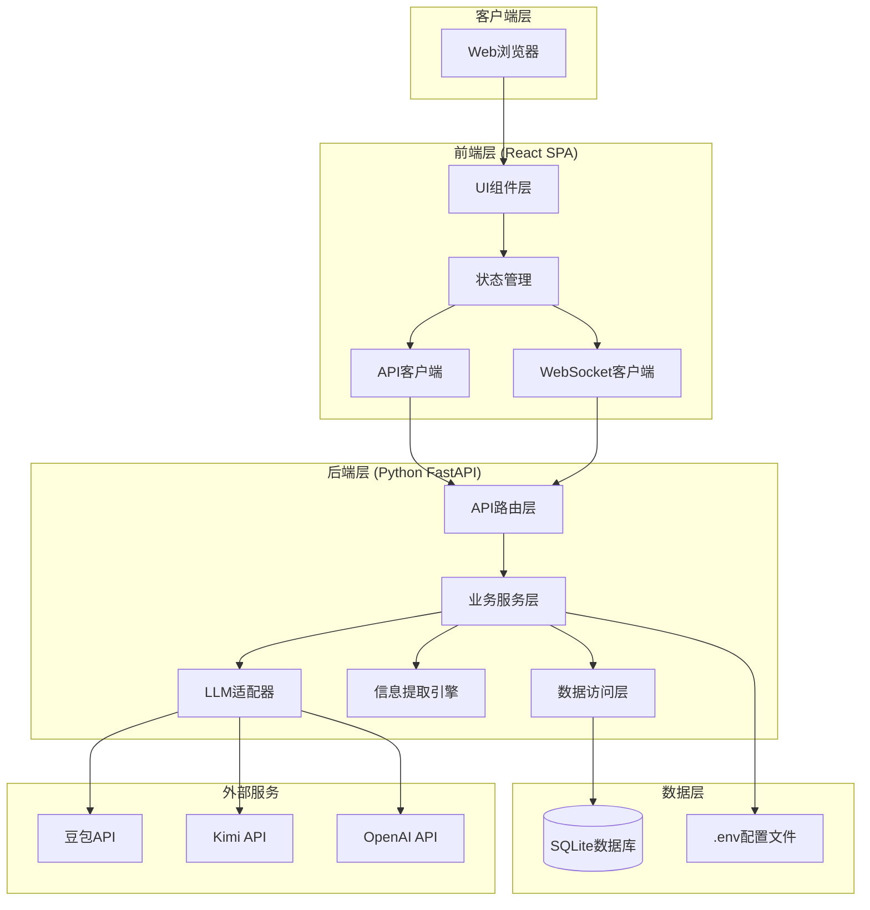
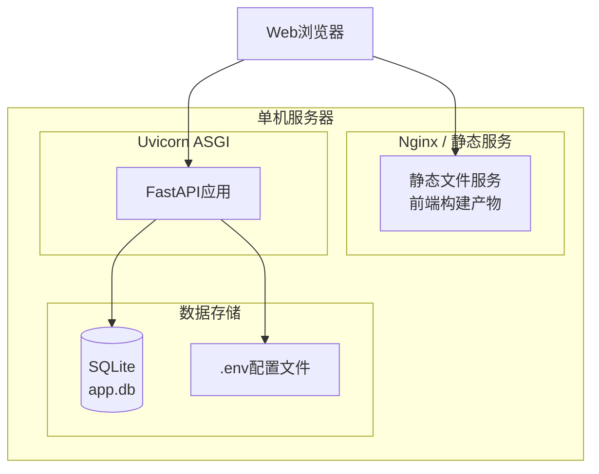

# 系统架构

## 1. 整体架构概述

项目管理助手机器人采用 **前后端分离** 的单体架构，适合单机部署运行。系统分为客户端层、前端层、后端层和数据层四个主要部分。

### 1.1 架构图



## 2. 模块划分与职责

### 2.1 前端模块划分

| 模块 | 职责 | 核心组件 |
|------|------|----------|
| **布局模块** | 整体页面布局，左右分栏 | MainLayout, Sidebar |
| **聊天模块** | 消息收发、历史记录、输入处理 | ChatWindow, MessageList, InputBox |
| **项目信息模块** | 项目数据展示、甘特图渲染 | ProjectTable, GanttChart, TaskDetail |
| **配置模块** | LLM配置界面、API Key管理 | ConfigForm, ModelSelector |
| **共享模块** | 工具函数、类型定义、API封装 | api.ts, types.ts, utils.ts |

### 2.2 后端模块划分

| 模块 | 职责 | 核心文件/类 |
|------|------|-------------|
| **API层** | HTTP路由定义、请求处理、响应格式化 | chat.py, project.py, config.py |
| **聊天服务** | 消息处理、对话管理、上下文维护 | chat_service.py, ChatService |
| **项目服务** | 项目CRUD、任务管理、进度计算 | project_service.py, ProjectService |
| **提取服务** | 从对话中提取项目信息 | extractor_service.py, ExtractorService |
| **LLM适配器** | 统一封装不同LLM API调用 | llm_adapter.py, DoubaoClient, KimiClient, OpenAIClient |
| **数据访问层** | 数据库操作、ORM模型 | models.py, database.py |
| **配置管理** | 读取.env、配置验证 | config.py, Settings |

## 3. 前后端通信协议

### 3.1 API设计规范
- **协议**: HTTP/1.1 或 HTTP/2
- **数据格式**: JSON
- **编码**: UTF-8
- **Content-Type**: `application/json`

### 3.2 主要API端点
- **聊天接口**: `/api/chat/messages`, `/api/chat/history`
- **项目接口**: `/api/projects`, `/api/projects/{id}`
- **任务接口**: `/api/projects/{id}/tasks`
- **甘特图接口**: `/api/projects/{id}/gantt`
- **配置接口**: `/api/config`

### 3.3 WebSocket设计
用于实时推送项目信息更新和流式对话响应。

## 4. 系统部署架构

### 4.1 单机部署架构



### 4.2 部署方式

#### 开发模式
```bash
# 后端
uvicorn main:app --reload --host 0.0.0.0 --port 8000

# 前端 (另一个终端)
npm run dev
```

#### 生产模式
```bash
# 1. 构建前端
cd frontend && npm run build

# 2. 配置静态文件服务（Nginx或直接由FastAPI提供）
# 3. 启动后端服务
uvicorn main:app --host 0.0.0.0 --port 8000
```

## 5. 扩展性设计

### 5.1 扩展点

| 扩展点 | 设计 |
|--------|------|
| **新LLM提供商** | 继承BaseLLMClient，实现新适配器 |
| **新提取字段** | 修改Pydantic模型和提取Prompt |
| **新图表类型** | 添加新API端点和前端组件 |
| **多用户支持** | 添加用户表和权限中间件 |

### 5.2 模块化设计
系统采用模块化设计，各组件之间通过明确的接口进行通信，便于扩展和维护。

## 6. 安全设计

### 6.1 安全措施

| 层面 | 措施 | 说明 |
|------|------|------|
| **API Key** | 存储在.env | 不提交代码库，运行时读取 |
| **CORS** | 配置跨域 | 限制允许的源 |
| **输入验证** | Pydantic | 所有请求数据验证 |
| **SQL注入** | SQLAlchemy ORM | 参数化查询 |
| **XSS** | React默认转义 | 自动转义HTML |

## 7. 开发计划建议

### 7.1 迭代计划

| 阶段 | 内容 | 预计时间 |
|------|------|----------|
| **MVP** | 基础聊天、项目表格、SQLite存储 | 1周 |
| **V1.0** | 甘特图、多LLM支持、配置界面 | 1周 |
| **V1.1** | 优化提取准确性、UI美化 | 3天 |

### 7.2 关键技术决策
1. **信息提取策略**: 使用Few-shot Prompt + JSON Schema约束
2. **甘特图渲染**: ECharts Gantt 或自定义SVG
3. **实时更新**: WebSocket推送或轮询