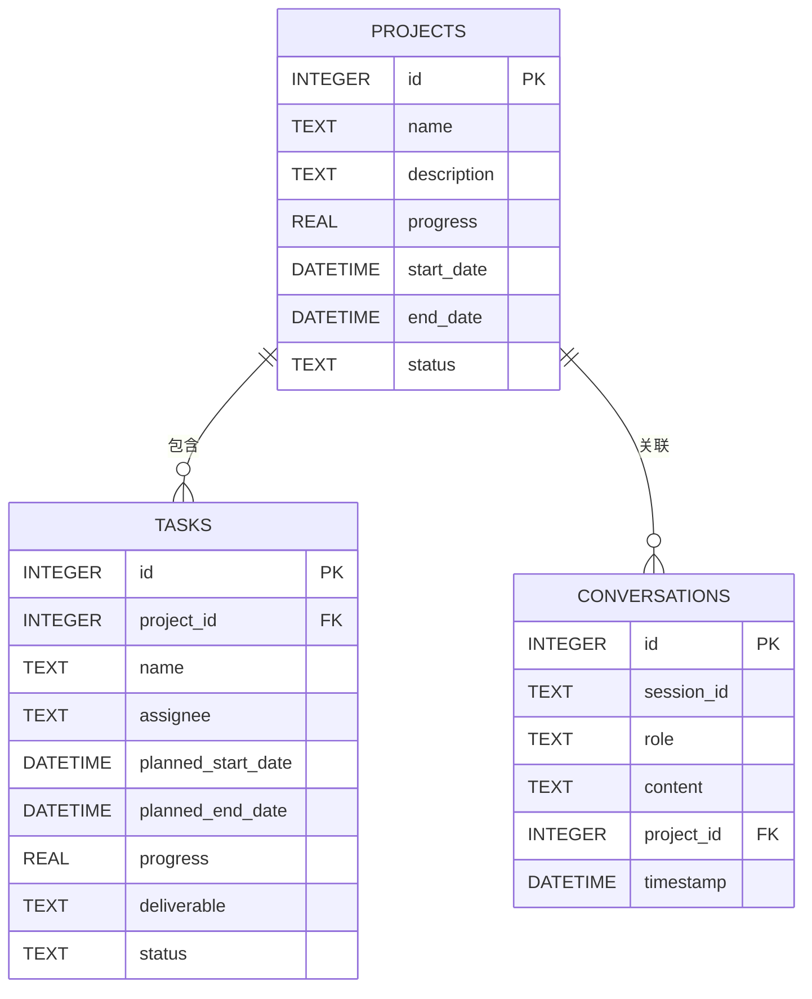

# 数据库设计

## 1. 数据库架构

### 1.1 数据库选型
- **数据库类型**: SQLite
- **存储方式**: 本地文件数据库
- **适用场景**: 单机部署，轻量级应用
- **优势**: 零配置，单文件存储，易于部署和备份

### 1.2 设计原则
- **规范化设计**: 遵循数据库规范化原则
- **性能优化**: 合理创建索引
- **可扩展性**: 支持未来功能扩展
- **数据完整性**: 使用约束确保数据一致性

## 2. 实体关系图

### 2.1 核心实体关系



## 3. 表结构设计

### 3.1 项目表 (projects)

| 字段 | 类型 | 约束 | 描述 |
|------|------|------|------|
| `id` | `INTEGER` | `PRIMARY KEY AUTOINCREMENT` | 项目ID |
| `name` | `TEXT` | `NOT NULL` | 项目名称 |
| `description` | `TEXT` | | 项目描述 |
| `progress` | `REAL` | `DEFAULT 0 CHECK (progress >= 0 AND progress <= 100)` | 总体进度(0-100) |
| `start_date` | `DATETIME` | | 开始时间 |
| `end_date` | `DATETIME` | | 结束时间 |
| `status` | `TEXT` | `DEFAULT 'pending' CHECK (status IN ('pending', 'active', 'completed', 'delayed'))` | 状态 |
| `created_at` | `DATETIME` | `DEFAULT CURRENT_TIMESTAMP` | 创建时间 |
| `updated_at` | `DATETIME` | `DEFAULT CURRENT_TIMESTAMP` | 更新时间 |

### 3.2 任务表 (tasks)

| 字段 | 类型 | 约束 | 描述 |
|------|------|------|------|
| `id` | `INTEGER` | `PRIMARY KEY AUTOINCREMENT` | 任务ID |
| `project_id` | `INTEGER` | `NOT NULL REFERENCES projects(id)` | 所属项目ID |
| `name` | `TEXT` | `NOT NULL` | 任务名称 |
| `assignee` | `TEXT` | | 负责人 |
| `planned_start_date` | `DATETIME` | | 计划开始时间 |
| `planned_end_date` | `DATETIME` | | 计划结束时间 |
| `actual_start_date` | `DATETIME` | | 实际开始时间 |
| `actual_end_date` | `DATETIME` | | 实际结束时间 |
| `progress` | `REAL` | `DEFAULT 0 CHECK (progress >= 0 AND progress <= 100)` | 完成进度(0-100) |
| `deliverable` | `TEXT` | | 交付物描述 |
| `status` | `TEXT` | `DEFAULT 'pending' CHECK (status IN ('pending', 'in_progress', 'completed', 'blocked'))` | 状态 |
| `priority` | `INTEGER` | `DEFAULT 2 CHECK (priority IN (1, 2, 3))` | 优先级(1-高, 2-中, 3-低) |
| `dependencies` | `TEXT` | | JSON数组存储依赖任务ID |
| `created_at` | `DATETIME` | `DEFAULT CURRENT_TIMESTAMP` | 创建时间 |
| `updated_at` | `DATETIME` | `DEFAULT CURRENT_TIMESTAMP` | 更新时间 |

### 3.3 对话表 (conversations)

| 字段 | 类型 | 约束 | 描述 |
|------|------|------|------|
| `id` | `INTEGER` | `PRIMARY KEY AUTOINCREMENT` | 对话ID |
| `session_id` | `TEXT` | `NOT NULL` | 会话ID |
| `role` | `TEXT` | `NOT NULL CHECK (role IN ('user', 'assistant', 'system'))` | 角色 |
| `content` | `TEXT` | `NOT NULL` | 消息内容 |
| `project_id` | `INTEGER` | `REFERENCES projects(id)` | 关联项目ID(可选) |
| `timestamp` | `DATETIME` | `DEFAULT CURRENT_TIMESTAMP` | 时间戳 |

### 3.4 配置表 (configs)

| 字段 | 类型 | 约束 | 描述 |
|------|------|------|------|
| `key` | `TEXT` | `PRIMARY KEY` | 配置键 |
| `value` | `TEXT` | `NOT NULL` | 配置值 |
| `updated_at` | `DATETIME` | `DEFAULT CURRENT_TIMESTAMP` | 更新时间 |

## 4. 数据迁移

### 4.1 数据库初始化

```python
# backend/models/database.py
from sqlalchemy import create_engine
from sqlalchemy.ext.declarative import declarative_base
from sqlalchemy.orm import sessionmaker

Base = declarative_base()

engine = create_engine('sqlite:///./data/app.db')
SessionLocal = sessionmaker(autocommit=False, autoflush=False, bind=engine)

def init_db():
    """初始化数据库"""
    Base.metadata.create_all(bind=engine)
```

### 4.2 迁移工具

使用 **Alembic** 进行数据库迁移：

```bash
# 安装 Alembic
pip install alembic

# 初始化 Alembic
alembic init alembic

# 创建迁移文件
alembic revision --autogenerate -m "Initial migration"

# 执行迁移
alembic upgrade head
```

## 5. 数据访问层

### 5.1 ORM模型

```python
# backend/models/entities.py
from sqlalchemy import Column, Integer, String, Text, Float, DateTime, ForeignKey, CheckConstraint
from sqlalchemy.sql import func
from .database import Base

class Project(Base):
    __tablename__ = "projects"
    
    id = Column(Integer, primary_key=True, index=True)
    name = Column(String, nullable=False)
    description = Column(Text)
    progress = Column(Float, default=0.0)
    start_date = Column(DateTime)
    end_date = Column(DateTime)
    status = Column(String, default="pending")
    created_at = Column(DateTime(timezone=True), server_default=func.now())
    updated_at = Column(DateTime(timezone=True), onupdate=func.now())
    
    __table_args__ = (
        CheckConstraint('progress >= 0 AND progress <= 100', name='check_progress_range'),
        CheckConstraint("status IN ('pending', 'active', 'completed', 'delayed')", name='check_status_values'),
    )

class Task(Base):
    __tablename__ = "tasks"
    
    id = Column(Integer, primary_key=True, index=True)
    project_id = Column(Integer, ForeignKey("projects.id"), nullable=False)
    name = Column(String, nullable=False)
    assignee = Column(String)
    planned_start_date = Column(DateTime)
    planned_end_date = Column(DateTime)
    actual_start_date = Column(DateTime)
    actual_end_date = Column(DateTime)
    progress = Column(Float, default=0.0)
    deliverable = Column(Text)
    status = Column(String, default="pending")
    priority = Column(Integer, default=2)
    dependencies = Column(Text)  # JSON数组
    created_at = Column(DateTime(timezone=True), server_default=func.now())
    updated_at = Column(DateTime(timezone=True), onupdate=func.now())
    
    __table_args__ = (
        CheckConstraint('progress >= 0 AND progress <= 100', name='check_task_progress_range'),
        CheckConstraint("status IN ('pending', 'in_progress', 'completed', 'blocked')", name='check_task_status_values'),
        CheckConstraint('priority IN (1, 2, 3)', name='check_priority_values'),
    )

class Conversation(Base):
    __tablename__ = "conversations"
    
    id = Column(Integer, primary_key=True, index=True)
    session_id = Column(String, nullable=False, index=True)
    role = Column(String, nullable=False)
    content = Column(Text, nullable=False)
    project_id = Column(Integer, ForeignKey("projects.id"), nullable=True)
    timestamp = Column(DateTime(timezone=True), server_default=func.now())
    
    __table_args__ = (
        CheckConstraint("role IN ('user', 'assistant', 'system')", name='check_role_values'),
    )

class Config(Base):
    __tablename__ = "configs"
    
    key = Column(String, primary_key=True)
    value = Column(Text, nullable=False)
    updated_at = Column(DateTime(timezone=True), server_default=func.now(), onupdate=func.now())
```

### 5.2 数据访问函数

```python
# backend/models/repository.py
from sqlalchemy.orm import Session
from .entities import Project, Task, Conversation, Config

class ProjectRepository:
    @staticmethod
    def get_projects(db: Session, skip: int = 0, limit: int = 100):
        return db.query(Project).offset(skip).limit(limit).all()
    
    @staticmethod
    def get_project(db: Session, project_id: int):
        return db.query(Project).filter(Project.id == project_id).first()
    
    @staticmethod
    def create_project(db: Session, project: Project):
        db.add(project)
        db.commit()
        db.refresh(project)
        return project

class TaskRepository:
    @staticmethod
    def get_tasks(db: Session, project_id: int):
        return db.query(Task).filter(Task.project_id == project_id).all()
    
    @staticmethod
    def create_task(db: Session, task: Task):
        db.add(task)
        db.commit()
        db.refresh(task)
        return task

class ConversationRepository:
    @staticmethod
    def get_conversations(db: Session, session_id: str):
        return db.query(Conversation).filter(Conversation.session_id == session_id).order_by(Conversation.timestamp).all()
    
    @staticmethod
    def create_conversation(db: Session, conversation: Conversation):
        db.add(conversation)
        db.commit()
        db.refresh(conversation)
        return conversation

class ConfigRepository:
    @staticmethod
    def get_config(db: Session, key: str):
        return db.query(Config).filter(Config.key == key).first()
    
    @staticmethod
    def set_config(db: Session, key: str, value: str):
        config = db.query(Config).filter(Config.key == key).first()
        if config:
            config.value = value
        else:
            config = Config(key=key, value=value)
            db.add(config)
        db.commit()
        return config
```

## 6. 数据查询优化

### 6.1 索引设计

| 表 | 索引字段 | 类型 | 目的 |
|------|----------|------|------|
| `projects` | `id` | PRIMARY | 主键索引 |
| `tasks` | `id` | PRIMARY | 主键索引 |
| `tasks` | `project_id` | INDEX | 加速按项目查询任务 |
| `conversations` | `id` | PRIMARY | 主键索引 |
| `conversations` | `session_id` | INDEX | 加速按会话查询消息 |
| `conversations` | `project_id` | INDEX | 加速按项目查询消息 |
| `configs` | `key` | PRIMARY | 主键索引 |

### 6.2 查询优化策略
- **使用索引**: 确保常用查询字段有适当的索引
- **避免全表扫描**: 使用WHERE子句过滤数据
- **批量操作**: 批量插入和更新减少数据库交互
- **延迟加载**: 按需加载关联数据

## 7. 数据备份与恢复

### 7.1 备份策略

#### 手动备份
```bash
# 复制数据库文件
cp data/app.db data/app.db.backup.$(date +%Y%m%d)
```

#### 自动备份
```bash
# 添加到crontab（Linux）或任务计划（Windows）
# 每天凌晨2点备份
0 2 * * * cp /path/to/data/app.db /path/to/backup/app.db.$(date +\%Y\%m\%d)
```

### 7.2 恢复方法

```bash
# 恢复备份
cp data/app.db.backup.20240101 data/app.db
```

## 8. 数据安全

### 8.1 安全措施
- **数据加密**: 敏感数据加密存储
- **访问控制**: 限制数据库文件权限
- **输入验证**: 防止SQL注入攻击
- **备份加密**: 备份文件加密存储

### 8.2 注意事项
- **SQL注入防护**: 使用ORM参数化查询
- **数据脱敏**: 敏感信息脱敏处理
- **日志安全**: 避免在日志中记录敏感信息

## 9. 扩展考虑

### 9.1 未来扩展

| 扩展功能 | 表结构调整 |
|----------|------------|
| **用户管理** | 添加 `users` 表，包含用户信息和权限 |
| **团队管理** | 添加 `teams` 表和 `team_members` 表 |
| **文件管理** | 添加 `files` 表，存储文件元数据 |
| **通知系统** | 添加 `notifications` 表，存储通知信息 |
| **标签系统** | 添加 `tags` 表和 `project_tags` 表 |

### 9.2 性能扩展
- **数据库迁移**: 未来可考虑迁移到PostgreSQL或MySQL
- **读写分离**: 针对高并发场景
- **缓存策略**: 使用Redis缓存热点数据