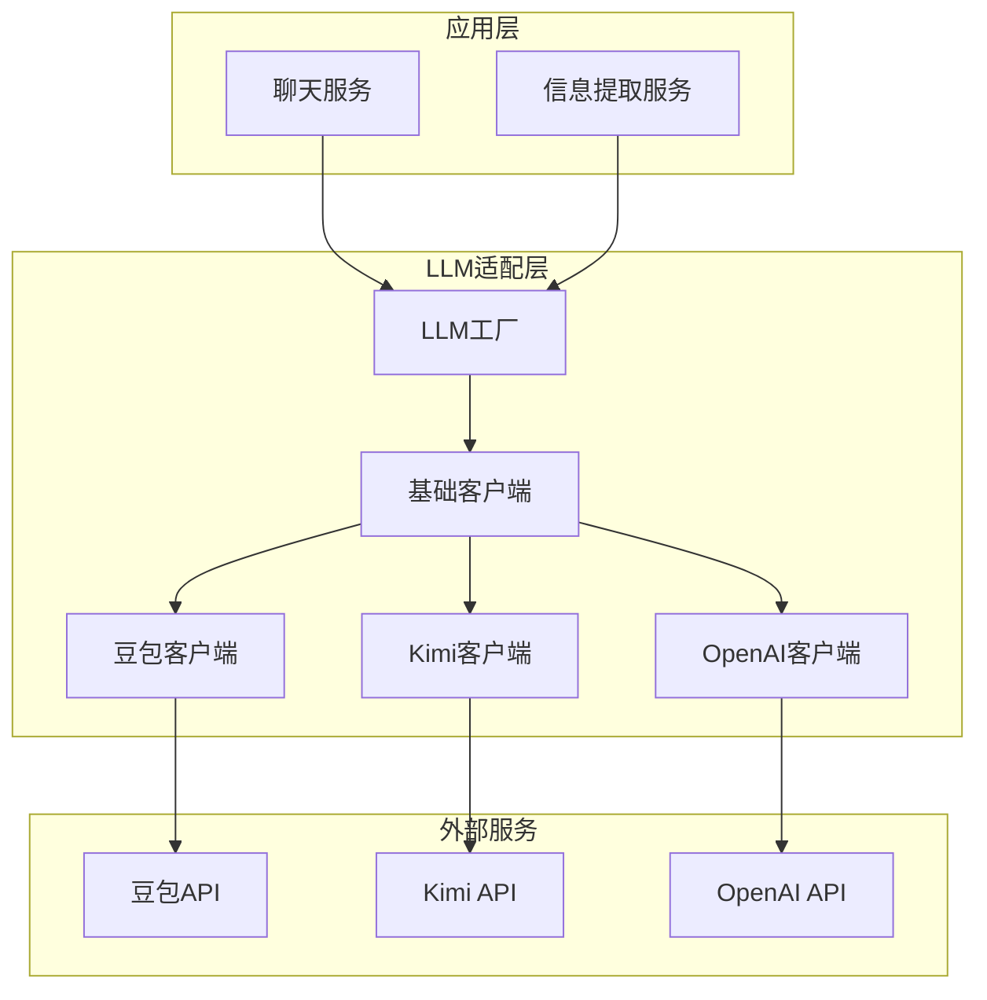

# LLM集成

## 1. 支持的LLM提供商

### 1.1 主要提供商

| 提供商 | 模型 | 特点 | Base URL |
|--------|------|------|----------|
| **OpenAI** | gpt-4-turbo, gpt-3.5-turbo | 功能全面，生态成熟 | https://api.openai.com/v1 |
| **Kimi** | kimi-k2-turbo, moonshot-v1 | 中文优化，长文本处理 | https://api.moonshot.cn/v1 |
| **豆包** | doubao-pro, doubao-lite | 性价比高，响应速度快 | https://ark.cn-beijing.volces.com/api/v3 |

### 1.2 模型对比

| 模型 | 上下文窗口 | 响应速度 | 中文支持 | 价格 |
|------|------------|----------|----------|------|
| gpt-4-turbo | 128K | 中等 | 良好 | 较高 |
| gpt-3.5-turbo | 16K | 快 | 一般 | 低 |
| kimi-k2-turbo | 200K | 快 | 优秀 | 中等 |
| doubao-pro | 128K | 快 | 优秀 | 低 |

## 2. 集成架构

### 2.1 整体架构



### 2.2 适配器设计

采用 **策略模式** 和 **工厂模式** 实现LLM集成：

- **BaseLLMClient**: 基础抽象类，定义统一接口
- **具体实现类**: 针对不同LLM提供商的具体实现
- **LLMFactory**: 根据配置创建相应的LLM客户端

## 3. 统一接口

### 3.1 核心接口定义

```python
from abc import ABC, abstractmethod
from typing import List, Iterator, Optional
from dataclasses import dataclass

@dataclass
class Message:
    role: str  # user, assistant, system
    content: str

@dataclass
class LLMConfig:
    api_key: str
    model: str
    base_url: Optional[str] = None
    temperature: float = 0.7
    max_tokens: int = 2000

@dataclass
class LLMResponse:
    content: str
    finish_reason: str
    usage: dict

@dataclass
class ResponseChunk:
    content: str
    finish_reason: Optional[str] = None

class LLMProviderInterface(ABC):
    @abstractmethod
    async def chat(self, messages: List[Message], config: LLMConfig) -> LLMResponse:
        """同步聊天接口"""
        pass
    
    @abstractmethod
    async def chat_stream(self, messages: List[Message], config: LLMConfig) -> Iterator[ResponseChunk]:
        """流式聊天接口"""
        pass
    
    @abstractmethod
    async def extract_project_info(self, text: str, config: LLMConfig) -> dict:
        """提取项目信息"""
        pass
```

### 3.2 工厂类

```python
class LLMFactory:
    @staticmethod
    def create(provider: str, api_key: str, model: str, base_url: Optional[str] = None) -> LLMProviderInterface:
        """根据提供商创建LLM客户端"""
        if provider == "doubao":
            return DoubaoClient(api_key, model, base_url)
        elif provider == "kimi":
            return KimiClient(api_key, model, base_url)
        elif provider == "openai":
            return OpenAIClient(api_key, model, base_url)
        raise ValueError(f"不支持的LLM提供商: {provider}")
```

## 4. 信息提取机制

### 4.1 提取Prompt设计

```yaml
system: |
  你是一个项目信息提取专家。从用户输入中提取项目相关信息，并以JSON格式输出。
  
  ## 提取字段
  - name: 项目名称
  - description: 项目描述
  - start_date: 开始日期 (YYYY-MM-DD)
  - end_date: 结束日期 (YYYY-MM-DD)
  - intent: 用户意图 (create/update/query/unknown)
  - tasks: 任务列表，每个任务包含：
    - name: 任务名称
    - start_date: 开始日期
    - end_date: 结束日期
    - assignee: 负责人
    - priority: 优先级 (high/medium/low)
  
  ## 输出格式
  必须输出有效的JSON，不要包含任何其他文字。

user: |
  帮我创建一个网站重构项目，开始时间是2024年1月1日，结束时间是2024年1月31日。
  包含以下任务：
  1. 需求分析，负责人张三，开始时间2024-01-01，结束时间2024-01-07
  2. UI设计，负责人李四，开始时间2024-01-08，结束时间2024-01-14
  3. 开发实现，负责人王五，开始时间2024-01-15，结束时间2024-01-25
  4. 测试部署，负责人赵六，开始时间2024-01-26，结束时间2024-01-31
```

### 4.2 提取流程

1. **构造Prompt**: 结合系统提示和用户输入
2. **调用LLM**: 使用chat接口获取结构化JSON
3. **解析结果**: 验证JSON格式并转换为Python对象
4. **数据处理**: 处理日期格式、优先级映射等
5. **存储更新**: 将提取的信息存储到数据库

### 4.3 提取准确性优化

- **Few-shot学习**: 提供示例提升提取准确性
- **JSON Schema约束**: 确保输出格式正确
- **错误处理**: 处理LLM返回非JSON格式的情况
- **重试机制**: 提取失败时自动重试

## 5. 流式响应实现

### 5.1 流式API设计

```python
async def chat_stream(
    self, 
    messages: List[Message], 
    config: LLMConfig
) -> Iterator[ResponseChunk]:
    """流式聊天实现"""
    # 构造请求参数
    payload = {
        "model": config.model,
        "messages": [msg.__dict__ for msg in messages],
        "stream": True,
        "temperature": config.temperature,
        "max_tokens": config.max_tokens
    }
    
    # 发送流式请求
    async with httpx.AsyncClient() as client:
        async with client.stream(
            "POST",
            f"{config.base_url}/chat/completions",
            headers={"Authorization": f"Bearer {config.api_key}"},
            json=payload
        ) as response:
            async for chunk in response.aiter_bytes():
                if chunk:
                    # 解析chunk
                    for line in chunk.decode().split("\n"):
                        if line.startswith("data: "):
                            data = line[6:]
                            if data == "[DONE]":
                                yield ResponseChunk(content="", finish_reason="stop")
                            else:
                                try:
                                    json_data = json.loads(data)
                                    content = json_data.get("choices", [{}])[0].get("delta", {}).get("content", "")
                                    if content:
                                        yield ResponseChunk(content=content)
                                except json.JSONDecodeError:
                                    pass
```

### 5.2 前端处理

```javascript
// 前端处理流式响应
async function streamChat(content) {
  const response = await fetch('/api/v1/chat/messages/stream', {
    method: 'POST',
    headers: {
      'Content-Type': 'application/json'
    },
    body: JSON.stringify({ content })
  });
  
  const reader = response.body.getReader();
  const decoder = new TextDecoder();
  let fullResponse = '';
  
  while (true) {
    const { done, value } = await reader.read();
    if (done) break;
    
    const chunk = decoder.decode(value);
    fullResponse += chunk;
    // 更新UI显示
    updateMessage(fullResponse);
  }
}
```

## 6. 配置与优化

### 6.1 环境变量配置

```bash
# LLM配置
DEFAULT_LLM_PROVIDER=openai

# OpenAI
OPENAI_API_KEY=your_openai_api_key
OPENAI_MODEL=gpt-4-turbo
OPENAI_BASE_URL=https://api.openai.com/v1

# Kimi
KIMI_API_KEY=your_kimi_api_key
KIMI_MODEL=moonshot-v1-8k
KIMI_BASE_URL=https://api.moonshot.cn/v1

# 豆包
DOUBAO_API_KEY=your_doubao_api_key
DOUBAO_MODEL=doubao-pro-32k
DOUBAO_BASE_URL=https://ark.cn-beijing.volces.com/api/v3

# 模型参数
LLM_TEMPERATURE=0.7
LLM_MAX_TOKENS=2000
```

### 6.2 性能优化

- **连接池**: 使用HTTP连接池减少连接建立开销
- **缓存**: 缓存常见请求的响应
- **批处理**: 批量处理多个请求
- **超时设置**: 合理设置API超时时间

### 6.3 错误处理

- **网络错误**: 处理API调用失败的情况
- **速率限制**: 处理API速率限制
- **认证错误**: 处理API Key无效的情况
- **模型错误**: 处理模型返回错误的情况

## 7. 监控与日志

### 7.1 监控指标

| 指标 | 描述 | 监控方式 |
|------|------|----------|
| **API调用次数** | 统计LLM API调用次数 | 计数器 |
| **响应时间** | 监控API响应时间 | 直方图 |
| **错误率** | 监控API错误率 | 计数器 |
| **token使用量** | 监控token使用情况 | 计数器 |

### 7.2 日志记录

```python
import logging

logger = logging.getLogger(__name__)

def log_llm_call(provider, model, prompt_tokens, completion_tokens, latency):
    """记录LLM调用日志"""
    logger.info(
        "LLM API调用",
        extra={
            "provider": provider,
            "model": model,
            "prompt_tokens": prompt_tokens,
            "completion_tokens": completion_tokens,
            "total_tokens": prompt_tokens + completion_tokens,
            "latency": latency
        }
    )
```

## 8. 扩展新LLM提供商

### 8.1 扩展步骤

1. **创建适配器类**: 继承BaseLLMClient
2. **实现核心方法**: chat、chat_stream、extract_project_info
3. **注册到工厂**: 在LLMFactory中添加新提供商
4. **配置环境变量**: 添加新提供商的配置

### 8.2 示例：添加新LLM提供商

```python
class NewLLMClient(BaseLLMClient):
    def __init__(self, api_key: str, model: str, base_url: str):
        self.api_key = api_key
        self.model = model
        self.base_url = base_url
    
    async def chat(self, messages: List[Message], config: LLMConfig) -> LLMResponse:
        # 实现同步聊天逻辑
        pass
    
    async def chat_stream(self, messages: List[Message], config: LLMConfig) -> Iterator[ResponseChunk]:
        # 实现流式聊天逻辑
        pass
    
    async def extract_project_info(self, text: str, config: LLMConfig) -> dict:
        # 实现信息提取逻辑
        pass

# 在LLMFactory中添加
class LLMFactory:
    @staticmethod
    def create(provider: str, api_key: str, model: str, base_url: Optional[str] = None) -> LLMProviderInterface:
        if provider == "new_llm":
            return NewLLMClient(api_key, model, base_url)
        # 其他提供商...
```

## 9. 最佳实践

### 9.1 Prompt设计最佳实践
- **清晰明确**: 明确告诉LLM要做什么
- **结构化**: 使用结构化的Prompt格式
- **示例引导**: 提供示例提升准确性
- **约束输出**: 明确输出格式要求

### 9.2 性能优化最佳实践
- **合理设置温度**: 根据任务类型调整temperature
- **控制上下文长度**: 只包含必要的上下文
- **使用流式响应**: 提升用户体验
- **缓存常见请求**: 减少重复调用

### 9.3 成本优化最佳实践
- **选择合适的模型**: 根据任务复杂度选择模型
- **优化Prompt长度**: 减少不必要的Prompt内容
- **批处理请求**: 合并多个请求
- **监控token使用**: 控制token使用量

## 10. 故障排查

### 10.1 常见问题

| 问题 | 可能原因 | 解决方案 |
|------|----------|----------|
| **API Key无效** | API Key错误或过期 | 检查API Key配置 |
| **速率限制** | 超出API调用限制 | 实现重试机制和限流 |
| **响应格式错误** | LLM返回非JSON格式 | 增加错误处理和重试 |
| **提取失败** | Prompt设计不合理 | 优化Prompt和提供示例 |
| **网络超时** | 网络连接问题 | 增加超时设置和重试 |

### 10.2 调试技巧
- **启用详细日志**: 记录完整的API请求和响应
- **测试单独调用**: 测试LLM API的单独调用
- **使用API测试工具**: 使用Postman等工具测试API
- **检查提供商状态**: 查看LLM提供商的服务状态