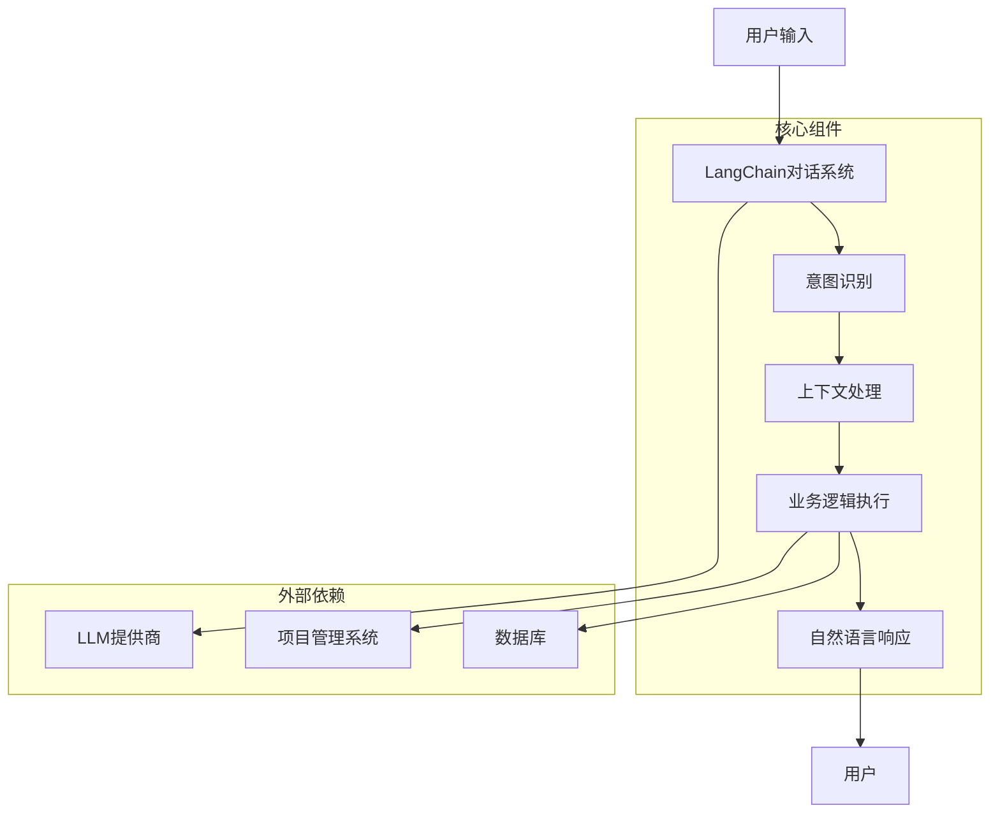
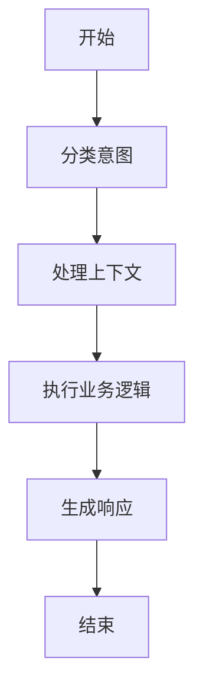

# LangChain意图识别与多轮对话系统技术架构文档

## 1. 系统架构

### 1.1 总体架构

本系统采用基于LangChain和LangGraph的架构设计，实现了一个智能的项目管理助手，通过自然语言交互帮助用户管理项目、任务和项目大类。系统的总体架构如下：



### 1.2 组件关系

| 组件 | 职责 | 依赖 |
|------|------|------|
| LangChain对话系统 | 核心对话管理，协调各组件工作 | LangGraph, LLM提供商 |
| 意图识别 | 分析用户输入，识别意图类型 | LLM提供商 |
| 上下文处理 | 处理对话历史，理解指代关系 | - |
| 业务逻辑执行 | 执行实际的项目管理操作 | 项目管理系统, 数据库 |
| 自然语言响应 | 生成友好的自然语言回复 | LLM提供商 |

## 2. 核心模块设计

### 2.1 LangChain对话系统

**文件**: `backend/core/langchain_chat.py`

**功能**: 作为系统的核心，负责管理整个对话流程，协调各组件的工作。

**主要组件**:
- **ConversationState**: 对话状态管理，维护对话历史、实体信息和上下文
- **LangChainChat**: 对话系统主类，实现对话流程的控制
- **StateGraph**: 使用LangGraph构建的对话状态机

**关键方法**:
- `chat(user_input)`: 处理用户输入并返回响应
- `_classify_intent(state)`: 分类用户意图
- `_process_context(state)`: 处理上下文和指代关系
- `_execute_business_logic(state)`: 执行业务逻辑
- `_generate_response(state)`: 生成自然语言响应

### 2.2 意图识别

**文件**: `backend/core/langchain_chat.py` (集成在LangChainChat类中)

**功能**: 分析用户输入，识别其意图类型，并提取相关数据。

**实现方式**:
- 使用LLM进行意图分类
- 构建详细的系统提示，指导LLM正确识别意图
- 从用户输入中提取结构化数据

**支持的意图类型**:
- create_project: 创建项目
- update_project: 更新项目
- delete_project: 删除项目
- query_project: 查询项目
- create_task: 创建任务
- update_task: 更新任务
- delete_task: 删除任务
- create_category: 创建项目大类
- update_category: 更新项目大类
- delete_category: 删除项目大类
- assign_category: 为项目分配大类
- query_category: 查询项目大类
- refresh_project_status: 刷新项目状态
- chat: 聊天/其他

### 2.3 上下文处理

**文件**: `backend/core/langchain_chat.py` (集成在LangChainChat类中)

**功能**: 处理对话历史，理解用户的指代关系，维护上下文信息。

**实现方式**:
- 维护对话状态，包括最近操作的项目、任务和大类
- 处理"他"、"它"、"这个"等指代关系
- 根据对话历史推断用户的意图和指代对象

### 2.4 业务逻辑执行

**文件**: `backend/core/langchain_chat.py` (集成在LangChainChat类中)

**功能**: 根据识别的意图执行相应的业务逻辑，与项目管理系统和数据库交互。

**实现方式**:
- 调用project_service执行具体的业务操作
- 处理异常情况，提供友好的错误提示
- 管理数据库会话和事务

### 2.5 自然语言响应

**文件**: `backend/core/langchain_chat.py` (集成在LangChainChat类中)

**功能**: 生成友好、自然的语言回复，向用户反馈操作结果。

**实现方式**:
- 使用LLM生成自然语言回复
- 根据操作结果和上下文生成合适的回复
- 确保回复符合用户的语言习惯

## 3. 数据模型

### 3.1 对话状态模型

**ConversationState**:
- `messages`: 对话历史消息列表
- `intent`: 当前识别的意图
- `confidence`: 意图识别的置信度
- `data`: 从用户输入中提取的数据
- `last_project`: 最近操作的项目名称
- `last_task`: 最近操作的任务名称
- `last_category`: 最近操作的项目大类名称
- `db`: 数据库会话
- `result`: 业务逻辑执行结果

### 3.2 业务数据模型

系统使用现有的项目管理系统数据模型，包括：
- **Project**: 项目信息
- **Task**: 任务信息
- **ProjectCategory**: 项目大类信息

## 4. 技术实现细节

### 4.1 LangGraph状态机

系统使用LangGraph构建了一个状态机，定义了对话流程的各个节点和边：



### 4.2 意图分类实现

1. **系统提示构建**:
   - 定义所有支持的意图类型
   - 提供详细的示例和指导
   - 强调数据提取的重要性

2. **LLM调用**:
   - 使用项目的LLM提供商
   - 构建消息列表，包含系统提示和用户输入
   - 解析LLM的JSON响应

3. **数据提取**:
   - 从用户输入中提取结构化数据
   - 处理特殊情况，确保数据完整性

### 4.3 上下文处理实现

1. **指代关系处理**:
   - 识别"他"、"它"、"这个"等指代词
   - 根据最近的操作历史推断指代对象
   - 自动填充缺失的参数

2. **对话历史管理**:
   - 维护最近的对话消息
   - 跟踪最近操作的实体
   - 限制对话历史长度，避免内存占用过大

### 4.4 业务逻辑执行实现

1. **操作执行**:
   - 调用project_service执行具体操作
   - 处理项目不存在等异常情况
   - 提供友好的错误提示

2. **数据库交互**:
   - 管理数据库会话
   - 处理事务和回滚
   - 确保数据一致性

### 4.5 自然语言响应实现

1. **回复生成**:
   - 使用LLM生成自然语言回复
   - 根据操作结果和上下文生成合适的回复
   - 确保回复符合用户的语言习惯

2. **错误处理**:
   - 处理LLM调用失败的情况
   - 提供默认的回复
   - 确保系统的稳定性

## 5. 测试框架

### 5.1 测试框架设计

**文件**: `tests/test_framework.py`

**功能**: 按照需求文档中的测试用例进行测试，支持扩展和复用。

**主要组件**:
- **TestCase**: 测试用例类，定义测试输入、预期输出和描述
- **TestResult**: 测试结果类，记录测试执行情况
- **TestFramework**: 测试框架类，运行测试用例并生成报告

**测试场景**:
- 单意图测试
- 组合意图测试
- 多轮对话测试
- 异常情况测试

### 5.2 测试报告

测试框架生成详细的测试报告，包括：
- 测试执行时间
- 测试用例数量和通过率
- 失败的测试用例详情
- 测试结果的JSON格式保存

## 6. 部署与配置

### 6.1 环境配置

**必需的环境变量**:
- `DOUBAO_API_KEY`: 豆包API密钥
- `DOUBAO_MODEL`: 豆包模型名称 (默认: doubao-1-5-pro-32k-250115)

**依赖项**:
- Python 3.8+
- LangChain
- LangGraph
- LangChain Community
- SQLAlchemy
- 项目管理系统依赖

### 6.2 部署步骤

1. **安装依赖**:
   ```bash
   pip install langchain langgraph langchain-community
   ```

2. **设置环境变量**:
   ```bash
   # Windows
   set DOUBAO_API_KEY=your_api_key
   set DOUBAO_MODEL=doubao-1-5-pro-32k-250115
   ```

3. **运行系统**:
   ```bash
   # 交互式测试
   python tests/langchain_chat_interactive.py
   
   # 自动化测试
   python tests/test_framework.py
   ```

## 7. 扩展性设计

### 7.1 意图扩展

系统设计支持轻松添加新的意图类型：
1. 在`intent_types`字典中添加新的意图类型
2. 在`_execute_business_logic`方法中添加相应的处理逻辑
3. 更新系统提示，包含新的意图类型

### 7.2 业务逻辑扩展

系统设计支持轻松集成新的业务逻辑：
1. 扩展`project_service`的方法
2. 在`_execute_business_logic`方法中添加相应的调用
3. 更新测试用例，包含新的业务逻辑测试

### 7.3 LLM提供商扩展

系统设计支持轻松更换LLM提供商：
1. 修改`get_default_provider`的实现
2. 更新系统提示，适应不同LLM的特点
3. 测试新的LLM提供商的性能和准确性

## 8. 性能优化

### 8.1 对话历史管理

- 限制对话历史长度，避免内存占用过大
- 只保留最近的对话消息，提高处理效率

### 8.2 LLM调用优化

- 优化系统提示，减少不必要的信息
- 合理设置模型参数，平衡性能和准确性
- 缓存常见问题的回复，减少LLM调用次数

### 8.3 数据库操作优化

- 使用批量操作，减少数据库交互次数
- 合理设置事务边界，确保数据一致性
- 使用索引，提高查询效率

## 9. 安全性考虑

### 9.1 API密钥保护

- 环境变量存储API密钥，避免硬编码
- 不在日志中记录API密钥
- 定期轮换API密钥

### 9.2 输入验证

- 验证用户输入，防止注入攻击
- 限制输入长度，防止DoS攻击
- 过滤敏感信息，保护用户隐私

### 9.3 错误处理

- 不向用户暴露详细的错误信息
- 记录错误日志，便于调试
- 提供友好的错误提示，引导用户正确操作

## 10. 总结

本系统采用基于LangChain和LangGraph的架构设计，实现了一个智能的项目管理助手。系统具有以下特点：

1. **智能意图识别**：准确识别用户输入的意图，提取相关数据
2. **多轮对话支持**：理解上下文信息，处理指代关系
3. **自然语言交互**：生成友好、自然的语言回复
4. **业务逻辑集成**：与项目管理系统和数据库无缝集成
5. **可扩展性**：支持轻松添加新的意图和业务逻辑
6. **安全性**：保护API密钥，验证用户输入，提供友好的错误处理

系统的设计符合现代软件工程的最佳实践，具有良好的可维护性和可扩展性。通过测试框架的验证，系统能够正确处理各种测试场景，包括单意图测试、组合意图测试、多轮对话测试和异常情况测试。